**Solución CTF  -  Anonforce**

**CTF de Try Hack Me, paso a paso con explicación de técnicas de
enumeración, explotación y post-explotación en Linux.**

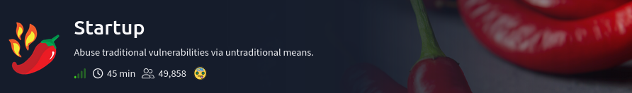{width="5.905555555555556in"
height="0.7958333333333333in"}

**La IP objetivo será: 10.66.135.20**

{width="5.905555555555556in"
height="0.88125in"}

Se prueba conexión hacia la IP objetivo por icmp.

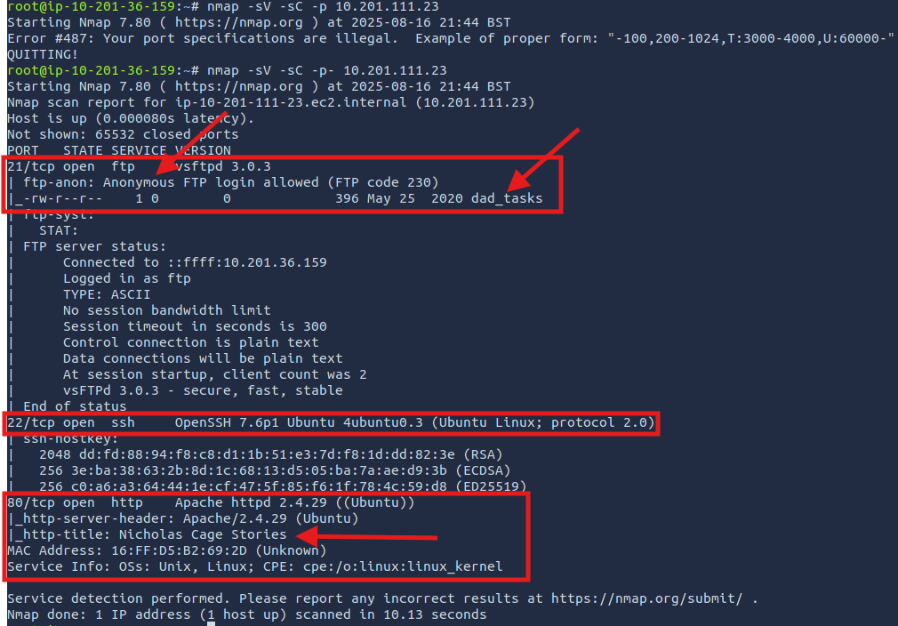{width="5.905555555555556in"
height="1.6576388888888889in"}

Se realiza la búsqueda de los primeros 1000 puertos más comunes con
nmap. (**nmap 10.66.135.20**). Se encontró 2 puertos abiertos (**FTP 21
y SSH 22**)

{width="5.905555555555556in"
height="1.6111111111111112in"}

Se realizó un escaneo con Nmap utilizando las opciones **-sV** para
identificar versiones de servicios, **-sC** para ejecutar scripts por
defecto y **-sS** (half-open scan) para un escaneo sigiloso, **-O** para
poder identificar el **SO** de la IP Objetivo. Como resultado, se
identificó que el servicio FTP permite **login anónimo** y cuenta con
varios directorios/archivos, lo que representa una posible
vulnerabilidad. (Comando: **nmap -sS -sV -sC -p 21,22 10.66.135.20
-O**), además de una parte informativa del Servidor FTP.

{width="5.905555555555556in"
height="4.857638888888889in"}

Se ingresar por ftp con las credeciales: **user: anonymous, password:
anonymous. **Comando:** ftp 10.66.135.20**

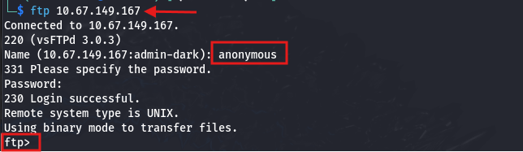{width="5.905555555555556in"
height="1.4652777777777777in"}

Entre todo el contenido que se observa, se ingresa varios directorios
interesantes.

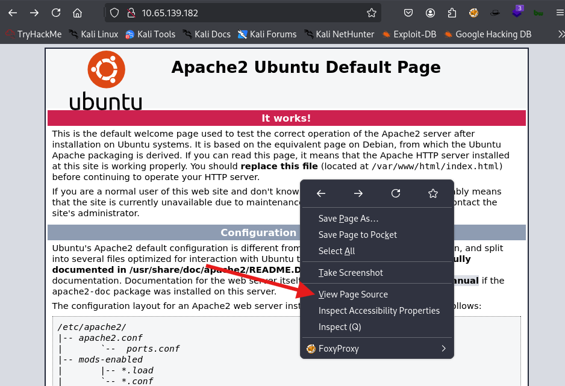{width="5.905555555555556in"
height="3.3152777777777778in"}

Se ingresa a la ruta "/home/melodías" (**cd home** y **cd melodias**) y
se encuentra el archivo "**user.txt**", se descarga dicho archivo.
(**get user.txt**). Agregar que se encontró al usuario "**melodias**"
que puede ser usado para un ataque de fuerza bruta.

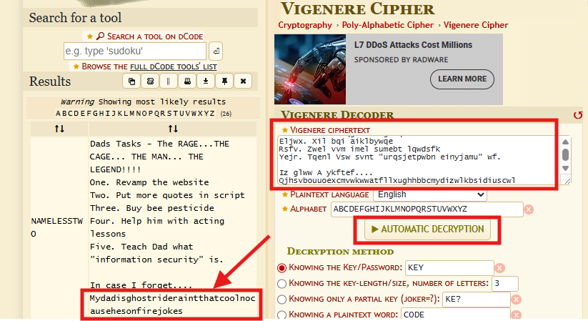{width="5.905555555555556in"
height="1.9333333333333333in"}

Se revisa dicho archivo y el valor es la 1era Flag:
**606083fd33beb1284fc51f411a706af8**

{width="4.188083989501313in"
height="0.5209055118110236in"}

Revisamos el directorio "**notread**" y se visualizan 2 archivos, se
descargan ambos, comandos: **get backup.pgp** y **get private.asc.**

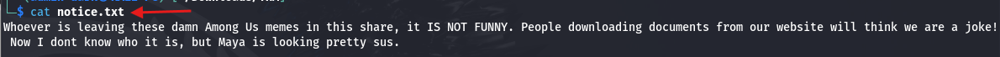{width="5.905555555555556in"
height="1.9972222222222222in"}

Se visualiza el 1er archivo es una llave privada en formato PGP.

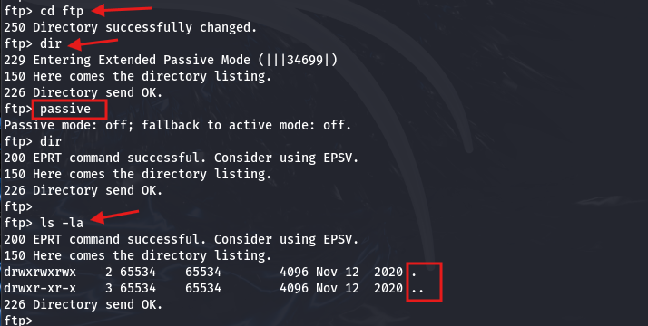{width="5.905555555555556in"
height="4.844444444444444in"}

Y el 2do archivo requiere una clave secreta para descifrarla.

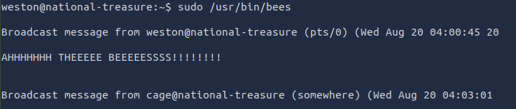{width="5.905555555555556in"
height="0.9277777777777778in"}

Se convierte la clave PGP en un hash que John entienda con el comando:
**gpg2john private.asc \> pgp_hash.txt**, luego realiza fuerza bruta
para encontrar el passphrase con el comando: **john
\--wordlist=/usr/share/wordlists/rockyou.txt pgp_hash.txt**, encontrando
el passphrase: **xbox360**

{width="5.905555555555556in"
height="1.5868055555555556in"}

Se procede a importar la clave privada del formato PGP con el comando:
**gpg \--import private.as**, luego se ingresa el passphrase:
**xbox360**

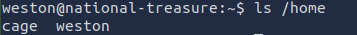{width="5.905555555555556in"
height="1.1965277777777779in"}

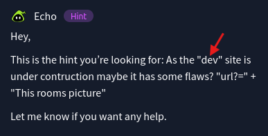{width="3.7505238407699037in"
height="3.2608716097987753in"}

Se procede a descifrar el archivo "**backup.pgp**" con el comando: **gpg
-d backup.pgp**, luego se ingresa el passphrase: **xbox36**, obteniendo
como resultado el archivo de password de usuarios **(/etc/passwd).**

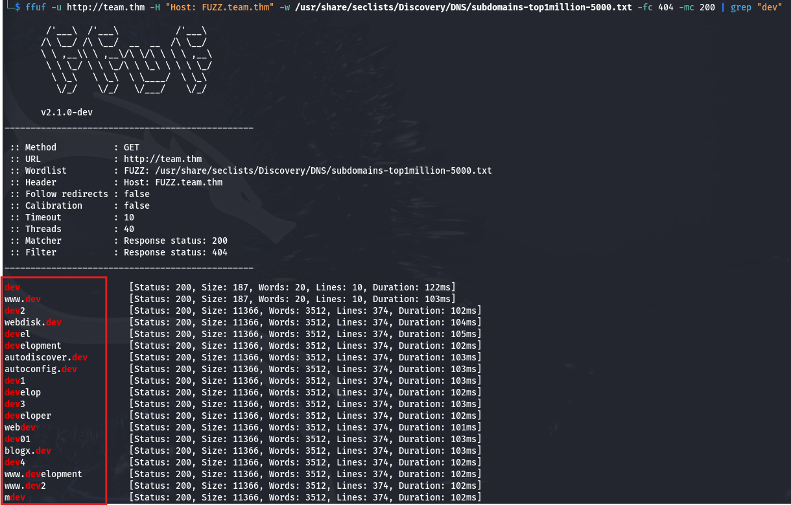{width="5.905555555555556in"
height="3.3048611111111112in"}

{width="3.8338681102362204in"
height="3.875541338582677in"}

Se crea el archivo "**passwd_root.txt**" y se copia solo el hash del
usuario root
"**\$6\$07nYFaYf\$F4VMaegmz7dKjsTukBLh6cP01iMmL7CiQDt1ycIm6a.bsOIBp0DwXVb9XI2EtULXJzBtaMZMNd2tV4uob5RVM0**",
comandos: nano **passwd_root.txt** y cat **passwd_root.txt**

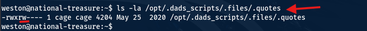{width="5.905555555555556in"
height="0.6131944444444445in"}

Se utiliza el comando: **hashcat \--help \| grep "\\\$6"**, para mostrar
**tod**os los tipos de hashes soportados por **hashcat** que inicien con
\$6\$, se observa que es **SHA512** y modo de hash 1800.

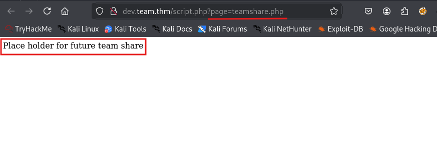{width="5.905555555555556in"
height="0.5145833333333333in"}

Se descifró el hash **SHA-512 (\$6\$)** con usando un ataque de
diccionario con la wordlist **rockyou.txt**, con modo de hash **-m
1800**, con **\--force** ignora advertencias y **-a 0** indica ataque
directo probando cada contraseña de la lista. Comando: **hashcat -m 1800
\--force -a 0 passwd_root.txt /usr/share/wordlists/rockyou.txt**,
obteniendo el password:
**hikari**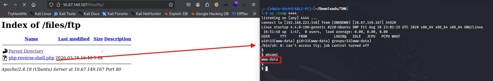{width="5.905555555555556in"
height="4.722916666666666in"}

Se ingresó por ssh con el user: **root** y password: **hikari**

{width="5.905555555555556in"
height="2.7423611111111112in"}

Se revisa el contenido de la carpeta actual, encontrando el archivo
**root.txt**, luego se visualiza dentro la 2da Flag:
**f706456440c7af4187810c31c6cebdce**

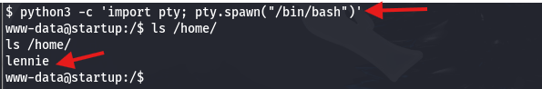{width="5.905555555555556in"
height="0.8145833333333333in"}

Adicionalmente se pudo obtener el password con un ataque de diccionario.
Comando: **hydra -l root -P /usr/share/wordlists/rockyou.txt -t 64 -f
ssh://10.66.135.20**

{width="5.905555555555556in"
height="1.5972222222222223in"}

Eso es todo xd, estaré subiendo mas soluciones de CTF en los siguientes
días, comenten si quiere que resuelva un CTF en especifico.
