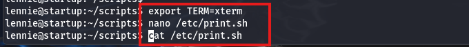
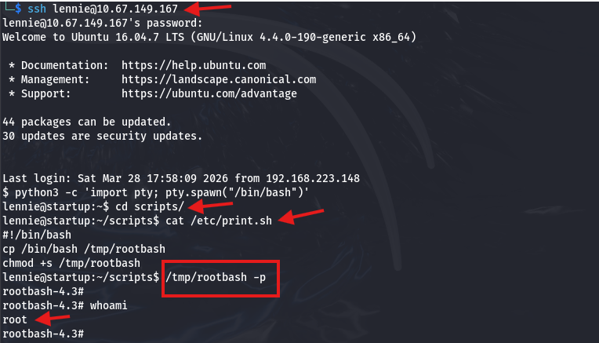
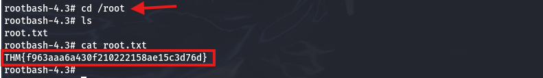

**Solución CTF  -  Startup**

**CTF de Try Hack Me, paso a paso con explicación de técnicas de
enumeración, explotación y post-explotación en Linux.**

**La IP objetivo será: 10.67.149.167**

Se prueba conexión hacia la IP objetivo por icmp.

Se realiza la búsqueda de los primeros 1000 puertos más comunes con
nmap. (**nmap 10.67.149.167**). Se encontró 3 puertos abiertos (FTP 21,
SSH 22 y HTTP 80)

Se realizó un escaneo con Nmap utilizando las opciones **-sV** para
identificar versiones de servicios, **-sC** para ejecutar scripts por
defecto y **-sS** (half-open scan) para un escaneo sigiloso.\
Como resultado, se identificó que el servicio FTP permite **login
anónimo** y cuenta con un directorio con permisos de escritura, lo que
representa una posible vulnerabilidad. (Comando: **nmap -sS -sV -sC -p
21,22,80 10.67.149.167**)

Se ingresar por ftp con las credeciales: **user:Anonymous,
password:Anonymous.**

Comando: **ftp 10.67.149.167**

Se visualizar los archivos con el comando "**dir**", se encuentran 2
archivos y 1 directorio llamado "**ftp**" con privilegios 777.

Descargamos los 2 archivos para revisar si tienen información que ayude
con la explotación. Comando: **get important.jpg** y **get notice.txt**

Se visualiza que el archivo: **important.jpg** es una imagen de meme

Se analiza el contenido archivo: **notice.txt**, en el cual se menciona
explícitamente al usuario o seudónimo "**maya**". Esta información
sugiere que dicho usuario es relevante dentro del sistema y puede ser
usado para realizar intentos de acceso.

Se ingresó a la carpeta "**ftp**", se listó el contenido incluso se
deshabilitó el modo passive, sin embargo, la carpeta está vacía.
(Comando: **cd ftp, passive, ls -la**).

Se realizó una búsqueda de directorios y se encontró el directorio
"**/files**" que es donde está expuesta en la web los recursos de ftp.
Comando: **gobuster dir -u http://10.67.149.167 -w
/usr/share/dirbuster/wordlists/directory-list-2.3-medium.txt -x txt, js,
php, zip -s 200,204,301,302,307,401,403 -b \"\" -t 200 -k**

Como se indicó, la carpeta "**ftp**" se encuentra vacía; sin embargo,
posee permisos 777, lo que permite la carga de archivos arbitrarios y su
ejecución. Dado que esta ruta es accesible desde el servidor web
(**/files/ftp/**), es posible subir un archivo malicioso, como una web
shell, para obtener ejecución remota de comandos (RCE) en el sistema.
Con la extensión "**wappalyzer**" se observa que es PHP el lenguaje de
programación.

En la ruta: **/usr/share/webshells/php/** se encuentran webshell
predeterminados, se copia al directorio actual para poder editarlo.
Comando: **cp /usr/share/webshells/php/php-reverse-shell.php .**

Editamos con el comando: **nano php-reverse-shell.php**, cambiamos donde
indica las variables **\$ip por la ip del Kali** y **\$port por
cualquier puerto**, en mi caso puerto 4444. Luego guardas cambios
(CTRL + X, luego ENTER y ENTER).

En Kali, se abre un puerto de escucha en el puerto 4444 usando Netcat.
Comando: **nc -lvnp
4444**

Se la sesión ftp activa, dentro de la carpeta "**ftp**", se carga el
archivo "**php-reverse-shell.php**".

Actualizamos la página en la web, y ya se visualiza el archivo php
cargado, le daremos click.

Al realizar click en el archivo, nos permite acceder al sistema con el
usuario "**www-data**" en el Kali.

Se revisó los archivos de la carpeta actual y se observó el archivo
"**recipe.txt**", luego se visualiza su contenido y se encuentra el
ingrediente secreto "**love**".

Ejecutamos el comando: **python3 -c 'import pty;
pty.spawn("/bin/bash")'**, para obtener una shell mejorada. Luego con el
comando "**ls /home/**" validamos que existe el usuario "**lennie**".

El usuario "**www-data**" tiene privilegios limitados, por lo que no
puede acceder al directorio **/home/lennie**.

Se visualiza el directorio "**incidents**" que es propietario del
usuario actual.

Se accede a la carpeta "**incidents**" y se visualiza un archivo
"**suspicious.pcapng**". Comando: **ls -la**

Se copia el archivo "**suspicious.pcapng**" a un directorio accesible
que ya se revisó anteriormente:
"**/var/www/html/files/ftp**".

Se vuelve a conectar por ftp con el usuario "**anonymous**", luego
accedemos a la carpeta "ftp" y descargamos el archivo
"**suspicious.pcapng**". Comandos: **cd ftp, ls, get
suspicious.pcapng.**

En nuestro directorio del Kali, con el comando "**wireshark
suspicious.pcapng**" abrimos el archivo para revisarlo.

En los logs se observa que alguien mas intentó acceder al directorio
"**/home/lennie**" desde la IP:**192.168.22.139**.

Se hace un filtro en wireshark con la ip encontrada: **ip.addr
==192.168.22.139,** se da click derecho en cualquier paquete y se escoge
la opción "**Follow**" y luego "**TCP
Stream".**

Se abre esta ventana, la cuál si nos desplazamos hacia abajo, observamos
que el atacante intento acceder al directorio "/home/lennie" y utilizó
la contraseña: **c4ntg3t3n0ughsp1c3** para ver que rutas puede acceder
como sudo.

Probamos el acceso con el usuario: **lennie** y password:
**c4ntg3t3n0ughsp1c3** y accedemos via ssh.

Ejecutamos el comando: **python3 -c 'import pty;
pty.spawn("/bin/bash")'**, para obtener una shell mejorada. Luego con
los comandos "**ls"** y **cat "user.txt**" encontramos la 1era Flag:
**THM {03ce3d619b80ccbfb3b7fc81e46c0e79}**

Revisamos el contenido actual y se observa que hay un directorio
"**scripts**" la cual tiene privilegios de root, dentro se encuentra el
archivo "**planner.sh**", la cuál puede ser ejecutado por todos y tiene
privilegios de root. Comandos: **ls -la, cd scripts/**

Revisamos la configuración del archivo "**planner.sh**" con el comando
"**cat planner.sh**" y vemos que tiene una variable "**\$LIST**" y un
archivo ejecutable "**/etc/print.sh**", dicho archivo tiene privilegios
para Leer, Modificar y ejecutar. Dentro del archivo "/etc/print.sh"
vemos que solo muestra el String "**Done!**".

Se ejecuta como prueba el comando: "**./planner.sh**" y se observa que
la ruta de la variable "**\$LIST**" no se tiene permisos y en 2da fila
el String "**Done!**".

Se ejecuta el comando: "export TERM=xterm" para que permita modificar
con **nano**, luego se modifica el archivo "**/etc/print.sh**" agregando
lo siguiente:
El comando: **cp /bin/bash /tmp/rootbash**, copia el binario de bash a
otra ubicación (/tmp/rootbash).
El comando: **chmod +s /tmp/rootbash** para activar el bit SUID en la
ubicación cambiada. (Debido a esto es probable que se quede pegada la
ventana o no responda).

Nuevamente se abre la conexión SSH desde otra terminal con el mismo
usuario y contraseña ya obtenidos. Luego, se accede al directorio
**/scripts** y se ejecuta el comando: **/tmp/rootbash -p**, el cual
corresponde a un binario con el bit SUID activado, permitiendo obtener
acceso como usuario root.

No se ejecutó **./planner.sh** debido a que, aunque el script pertenece
a root, al ser ejecutado manualmente por el usuario lennie se corre con
sus propios privilegios y no escala privilegios. En cambio,
**/tmp/rootbash** sí permite la elevación porque posee el bit SUID, lo
que hace que se ejecute con los permisos del propietario (root).

Ingresamos a la carpeta "**root**" y revisamos que entre sus archivo se
encuentra "**root.txt**", al visualizar su contenido encontramos la 2da
Flag: **THM{f963aaa6a430f210222158ae15c3d76d}**

Eso es todo xd, estaré subiendo mas soluciones de CTF en los siguientes
días, comenten si quiere que resuelva un CTF en especifico.
