**Solución CTF - Year of the Rabbit**

CTF de Try Hack Me, paso a paso con explicación de técnicas de
enumeración, explotación y post-explotación en Linux.

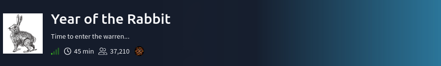

**La IP objetivo será: 10.65.169.178**

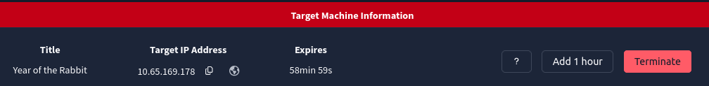

Se prueba conexión hacia la IP objetivo por icmp.

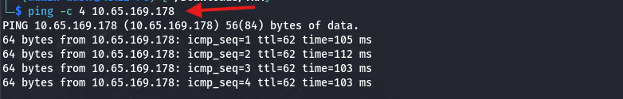

Se realiza la búsqueda de los 1000 puertos más comunes con nmap. El
parámetro **-sS** es para que solo espere la respuesta del SYN/ACK y es
más sigiloso. (**nmap -sS 10.65.169.178**). Se encontró 3 puertos
abiertos (FTP 21, SSH 22 y HTTP 80)

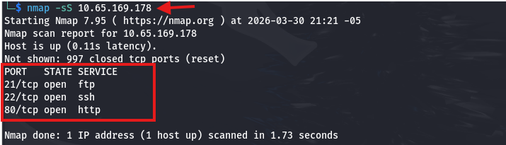

Se realizó un escaneo con Nmap utilizando las opciones **-sV** para
identificar versiones de servicios, **-sC** para ejecutar scripts por
defecto y **-sS** (half-open scan) para un escaneo sigiloso.
(Comando: **nmap -sS -sV -sC -p 21,22,80 10.65.169.178**).

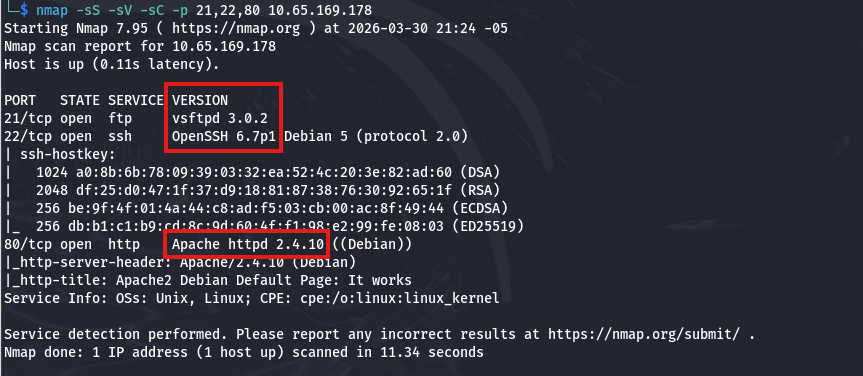

No se encuentran vulnerabilidades en las versiones encontradas, se
realiza un escaneo de directorios y se encuentra el directorio
"**/assets**", comando: **dirb
http://10.65.169.178/**

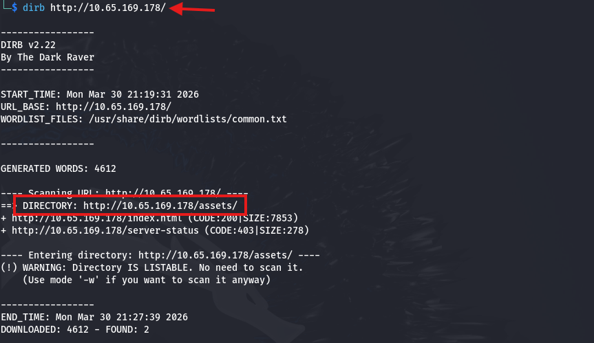

Se carga la pagina via web y se observa que es un "**directory
listing**". Se revisará el archivo "**style.css**"

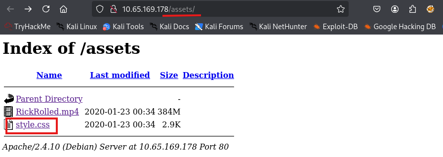

Se observa que hay un archivo oculto **.php** llamado:
"**/sup3r_s3cr3t_fl4g.php**"

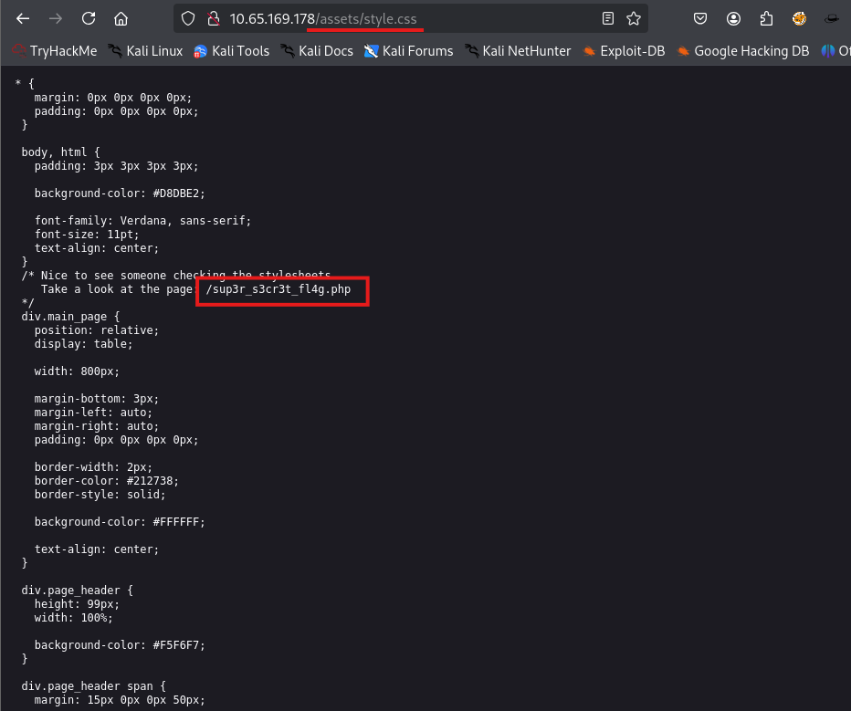

Al cargar el archivo via web
"**http://10.65.169.178/sup3r_s3cr3t_fl4g.php**", nos solicita apagar el
javascript.

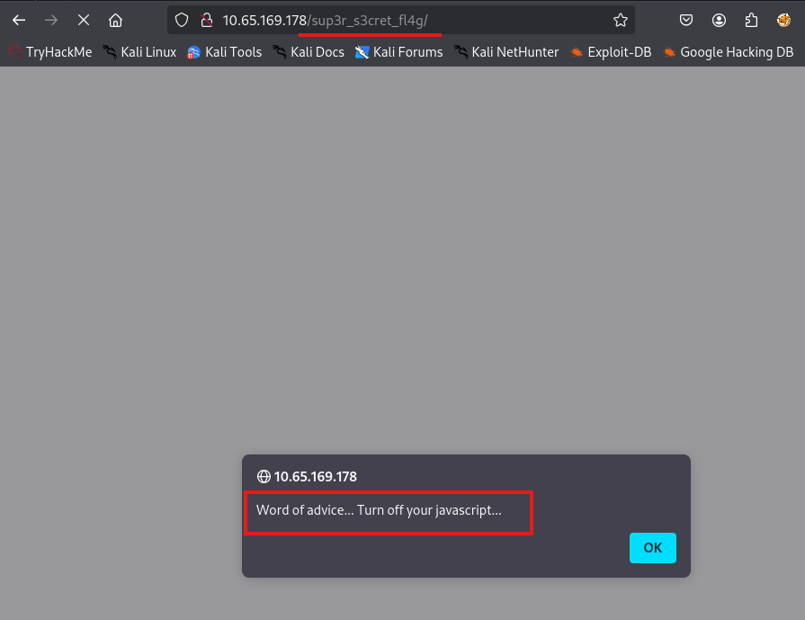

Se abrió la configuración del navegador Mozilla en otra ventana

(**about:config**), se filtró por la palabra "**javascript**" y se
deshabilitó, ahora ya esta en
"**false**".

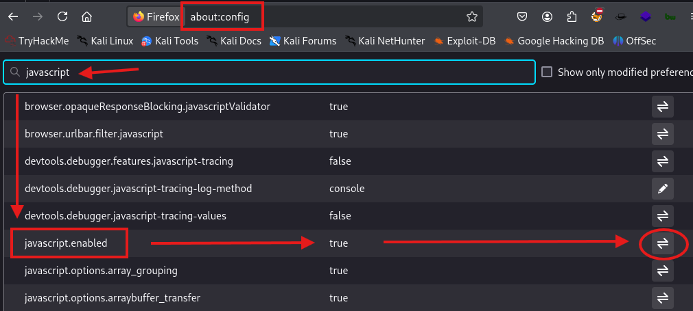
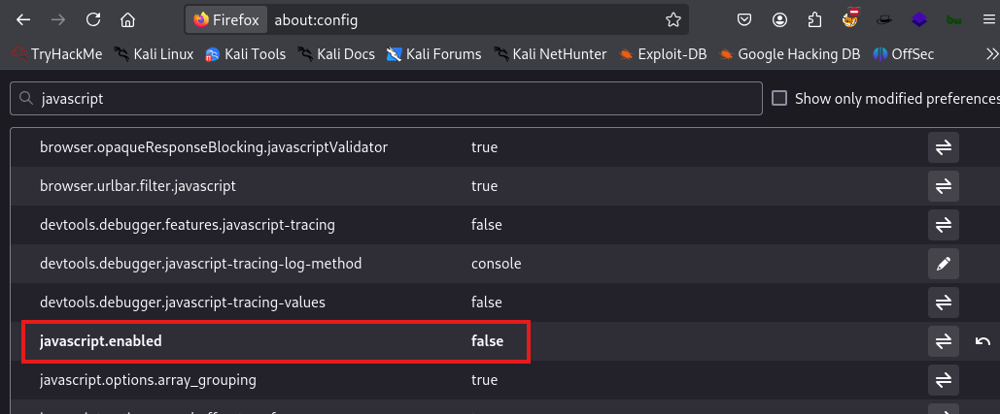

Se actualiza la web **http://10.65.169.178/sup3r_s3cret_fl4g.php** y se
observa que ahora ya carga y que la pista esta en el video, por lo que
al capturar su tráfico con **Burpsuite** se encuentra un directorio
oculto "**/WExYY2Cv-qU**"

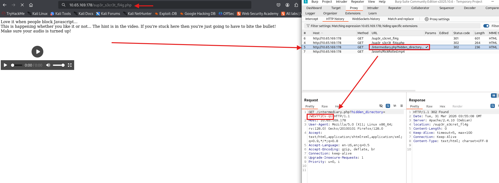

Al ingresar a dicho directorio, se encuentra con un archivo
"**Hot_Babe.png**", que al visualiza es una mujer.

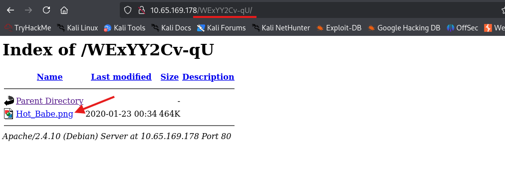
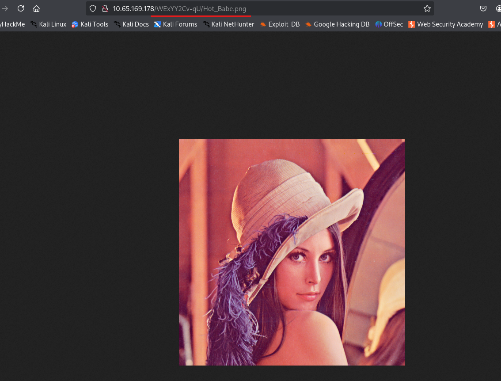

Se descarga dicha imagen para analizarlo, comando: **wget
http://10.65.169.178/WExYY2Cv-qU/Hot_Babe.png**

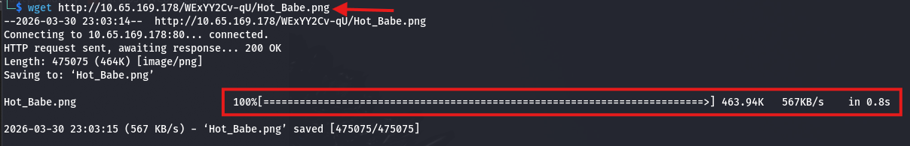

Se utiliza el comando: **strings Hot_Babe.png**, para ver el texto
legible escondido dentro del archivo **.png**, y se encuentra en la
ultima parte el usuario ftp: **ftpuser** y el password es una de la
lista que esta más debajo de ahí.

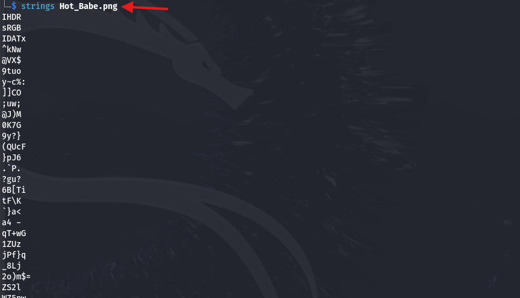
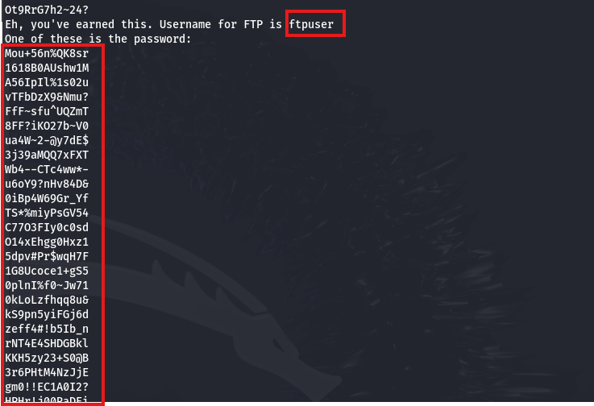

Se creó el archivo "**passwords.txt**" y se agregó todos los textos que
son posibles passwords válidos.

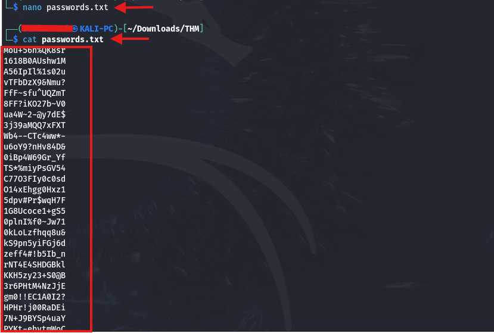

Se utiliza el comando: **hydra -l ftpuser -P passwords.txt -t 64 -f -V
<ftp://10.65.169.178>** y mediante de un ataque de fuerza bruta se
encuentra las credenciales correctas, username: **ftpuser** y password:
**5iez1wGXKfPKQ**

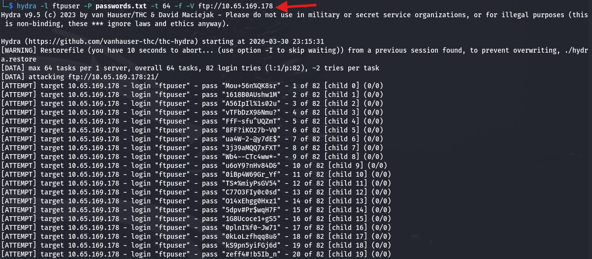
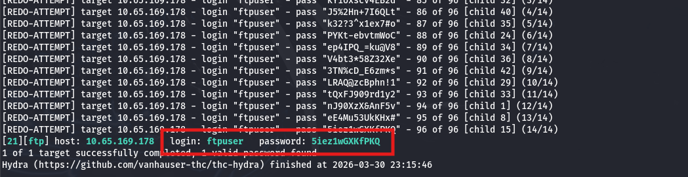

Se accede por ftp con las credenciales encontradas (**ftp
10.65.169.178**), luego se revisa que archivos hay con el comando
"**dir**", y luego se descarga el único archivo de nombre
"**Eli\'s_Creds.txt**" con el comando: **get
Eli\'s_Creds.txt**

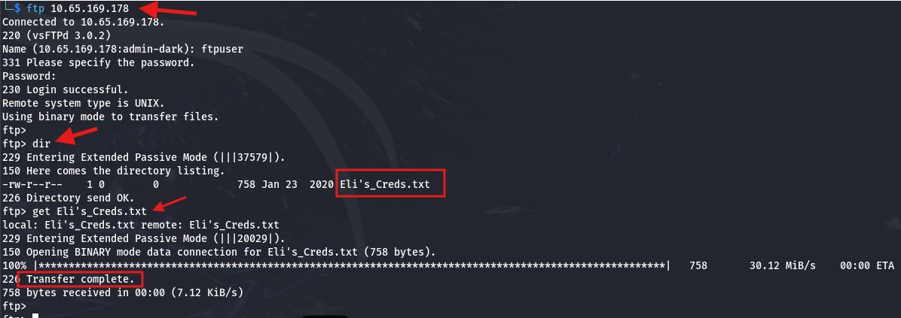

Se visualiza el contenido del archivo y se observa texto codificado
(**cat Eli\\\'s_Creds.txt**), se estuvo probando varios tipos de
codificación y se encontró que está en-codificado en **Brainfuck**

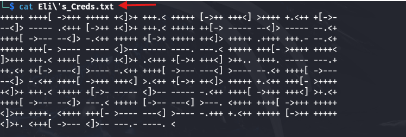

Se decodifico dicho texto en la URL:
[**https://www.dcode.fr/brainfuck-language**](https://www.dcode.fr/brainfuck-language),
obteniendo las credenciales, user: **eli** y password: **DSpDiM1wAEwid**

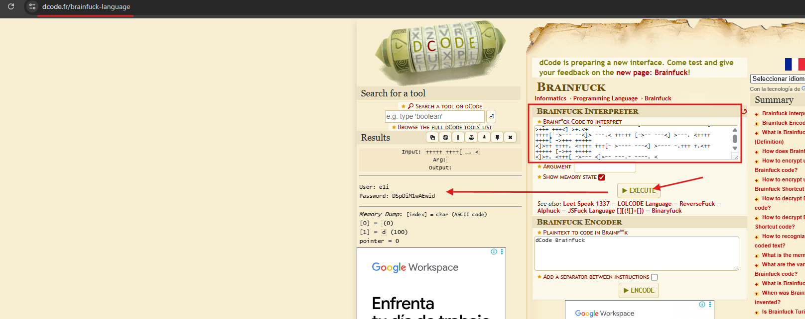

Acceso via ssh con las credenciales encontradas, y se observa que se
recibe un mensaje del usuario root: **\"Gwendoline, no estoy contento
contigo. Revisa nuestro escondite secreto. Te dejé un mensaje oculto
allí\",** como el mensaje dice "leet s3cr3t hiding place", lo más
probable es que el contenido o el archivo escondido tenga alguna palabra
de esa frase.

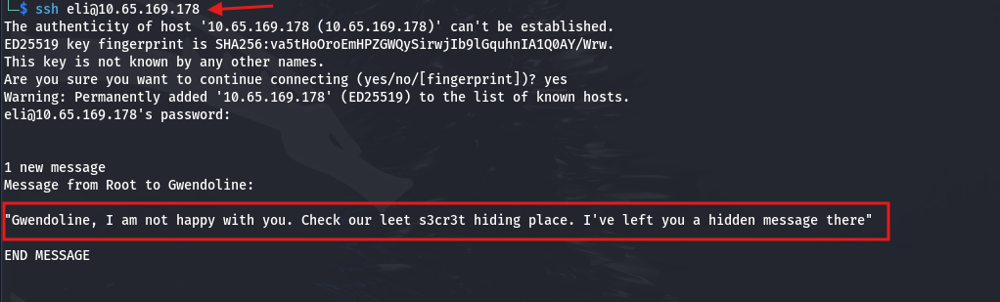

Se realiza la búsqueda con las palabras "**leet**" y "**s3cr3t**"
(comando **locate**), logrando descubrir 2 archivos, un archivo **.php**
que ya es conocido (donde se encontró el directorio oculto
**/WExYY2Cv-qU** vía web) y en el otro archivo se encontró credenciales:
user: **gwendoline** pass: **MniVCQVhQHUNI**, comandos: **cat
/var/www/html/sup3r_s3cr3t_fl4g.php** y **cat
/usr/games/s3cr3t/.th1s_m3ss4ag3_15_f0r_gw3nd0l1n3_0nly!**

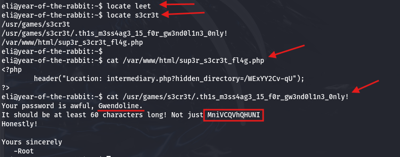

Ingresamos vía ssh con el usuario encontrado y en su directorio se ubica
la 1era Flag: **THM{1107174691af9ff3681d2b5bdb5740b1589bae53}**,
comando: **ssh <gwendoline@10.65.169.178>** y **cat user.txt**

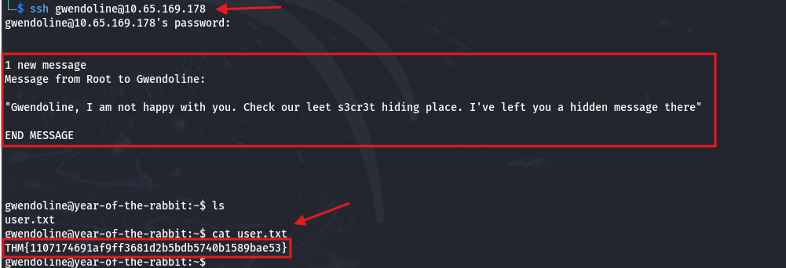

Se ejecuta el comando **sudo -l** para verificar qué comandos o rutas
puede ejecutar el usuario con privilegios de sudo, y encontramos que
todos a excepción de root pueden ejecutar "**/usr/bin/vi
/home/gwendoline/user.txt**" como
sudo.

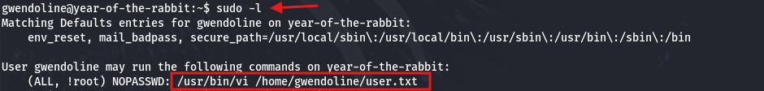

Se verificó que al usar: "**-u#-1**" si se permite ejecutar, esto es
debido a que el sistema lo interpreta como "**root**", por lo que se
ejecutó el comando: **sudo -u#-1 /usr/bin/vi /home/gwendoline/user.txt**
para editar el documento con **vi**.

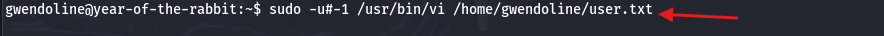

Dentro del editor del documento, escribes "**: shell**" + ENTER para
salir del editor, y logramos acceder como usuario **root**

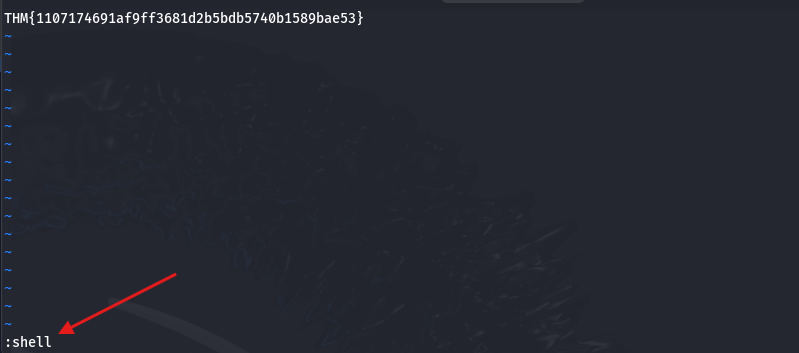
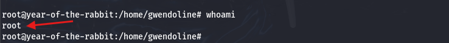

Luego revisamos dentro del directorio "**/root**" y encontramos la 2da
Flag: **THM{8d6f163a87a1c80de27a4fd61aef0f3a0ecf9161},** comando: **cat
/root/root.txt**

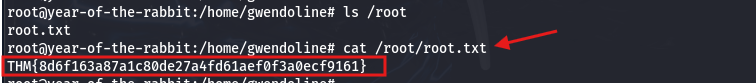

Eso es todo xd, estaré subiendo más soluciones de CTF en los siguientes
días, comenten si quiere que resuelva un CTF en específico.
